# Hires Chess Trainer

> **Allenati sui TUOI errori reali.** Importa le tue partite da Chess.com e
> lichess, scopri dove sbagli — tattica, aperture, finali — e correggi quegli
> errori con la **ripetizione spaziata**, finché non diventano automatici.

<p align="center">
  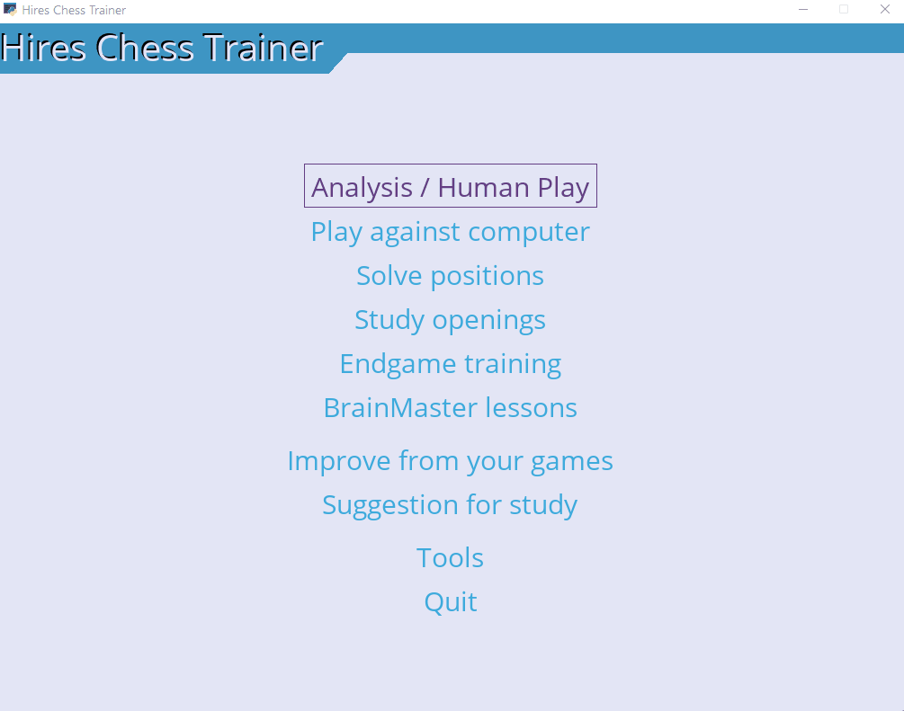
  <br><sub><em>Importa le partite → individua gli errori → allenamento mirato con ripetizione spaziata.</em></sub>
</p>

📦 *Installazione:* [INSTALL.md](INSTALL.md) · 🔧 *Build dell'eseguibile:* [BUILD.md](BUILD.md)

> Chess trainer in Python con Stockfish e Syzygy tablebases · learning base
> con ripetizione spaziata su tattica, repertorio d'apertura e finali ·
> auto-tracking degli errori in ogni modalità · statistiche di posizione
> contro un PGN di riferimento (le tue partite) · importazione partite da
> Chess.com e lichess · banco di prova per modelli di **apprendimento
> personalizzato basato su reinforcement learning** · supporto Windows.

🇬🇧 *English version:* [README.md](README.md)

**Hires Chess Trainer** è un'applicazione desktop per allenarsi e migliorare a scacchi.
Permette di giocare contro il computer o contro un altro umano, di **analizzare**
partite con varianti e annotazioni, e di **studiare** posizioni ed errori tramite
"learning base" e lezioni (anche assistite dal servizio AI *BrainMaster*).

## Screenshot

| Personal Stats — il tuo storico in una posizione | Study advisor — urgenza per ECO | Pannello Notazione — albero varianti |
|:---:|:---:|:---:|
| [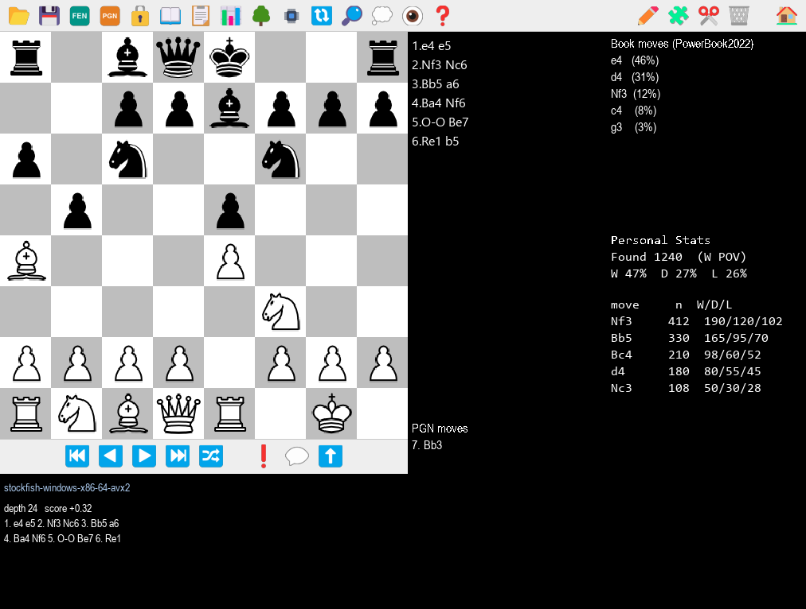](docs/img/stats.png) | [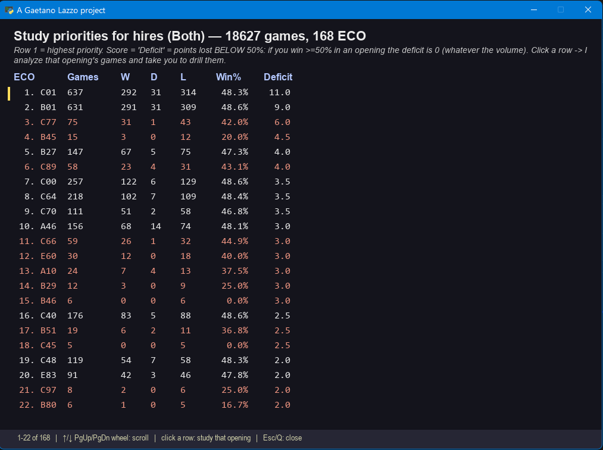](docs/img/advisor.png) | [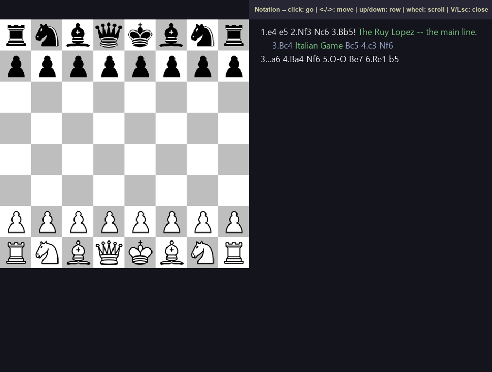](docs/img/notation.png) |

---

## Indice
➡️ **Sei nuovo?** Parti da [Primi passi: ricette pratiche](#primi-passi-ricette-pratiche).

1. [Avvio e requisiti](#1-avvio-e-requisiti)
2. [Il menu principale](#2-il-menu-principale)
3. [Le modalità](#3-le-modalità)
4. [Comandi durante una partita](#4-comandi-durante-una-partita)
5. [Analizzare una partita: varianti, annotazioni, commenti](#5-analizzare-una-partita)
6. [Il pannello Notazione](#6-il-pannello-notazione)
7. [Salvare e caricare partite](#7-salvare-e-caricare-partite)
8. [Strumenti (Tools)](#8-strumenti-tools)
9. [Concetti chiave](#9-concetti-chiave)
10. [File e cartelle](#10-file-e-cartelle)
11. [Appendice tecnica](#appendice-tecnica-struttura-della-learning-base)

---

## 1. Avvio e requisiti

Avvia il programma con:

```
python chessMain.py
```

Oppure da **VS Code**: apri la cartella e premi **F5** (la config "Run Chess" è inclusa in `.vscode/launch.json` e parte già con la cwd corretta).

Per funzionare al meglio servono (configurabili da **Tools → Setup**, vedi §8):
- un **motore UCI** (es. Stockfish) nella cartella `engines/` — usato per l'analisi e per il gioco contro il computer;
- (opzionale) un **libro di aperture** Polyglot (`.bin`) nella cartella `books/`;
- (opzionale) l'indirizzo del servizio **BrainMaster** (`base_url`) e l'`id studente`, se vuoi usare le lezioni assistite.

All'avvio appare il **menu principale**; ci si sposta con il **mouse** o le frecce e si conferma con **Invio**.

> **Splash screen.** I primi ~3-4 secondi di startup (init TTS, lettura delle
> learning base, apertura del libro Polyglot e di Stockfish) sono coperti da una
> finestra con `pic-chess.png` centrato e *"Caricamento in corso..."* in basso —
> niente più console immobile.

---

## Primi passi: ricette pratiche

*Se è la prima volta che usi il programma, parti da qui: queste sono le attività
più comuni, passo per passo.*

### Ricetta 0 — Configurazione iniziale (una volta sola)
1. **Tools → Setup → Choose engine**: seleziona il motore UCI (es. `stockfish.exe`)
   dalla cartella `engines/`. Senza motore, analisi e gioco contro il computer non funzionano.
2. *(Facoltativo)* **Choose book**: seleziona un libro di aperture `.bin` da `books/`.
3. *(Facoltativo, per le lezioni)* compila **base_url** e **id studente** del servizio BrainMaster.

### Ricetta principale — *Migliora dalle tue partite* (wizard)
*La via più rapida per allenarsi sui propri errori a partire dalle partite Chess.com:
il wizard orchestra tutti i passaggi delle Ricette A/B in automatico.*
1. Menu principale → **Migliora dalle tue partite**.
2. Compila:
   - **Utente Chess.com**: il tuo username;
   - **Giochi**: *White*, *Black* o *Both* (filtra il download per colore);
   - **Partite**: *Ultime 500/1000/2000/Tutte* (scarica solo gli archivi mensili necessari, partendo dai più recenti — utile se hai migliaia di partite);
   - **Focus**: *Tattica*, *Aperture* o *Entrambi* (preset di parametri diversi sotto il cofano);
   - **Accuratezza**: *Quick / Balanced / Thorough* (tempo del motore vs profondità).
3. **Start** — vedi una schermata di avanzamento `N/M` mentre il motore analizza. A fine analisi
   compaiono i pulsanti **Allena tattica / aperture** che entrano direttamente in *Solve positions*
   sulla base appena creata.
4. Le sessioni successive si riprendono da Menu principale → **Solve positions** scegliendo
   la base `<utente>_tactics` o `<utente>_openings` (persistente in `data/`).

> Il wizard è **idempotente**: rilanciarlo con partite nuove aggiunge gli errori nuovi senza
> duplicare quelli già presenti (deduplica per posizione zobrist).

### Ricetta A — Correggere i propri errori (flusso manuale, come Bianco o come Nero)
*Obiettivo: ripassare le posizioni in cui hai sbagliato nelle tue partite.*
1. **Scarica le tue partite** — Tools → Download Chess.com games:
   - *PGN file to create*: un nome, es. `mie_bianche`;
   - *player*: il tuo username Chess.com;
   - *Player color*: **White** per gli errori col Bianco (usa **Black** per quelli col Nero);
   - **Download games**.
2. **Crea una learning base vuota** — Tools → Create learning base:
   - *filename*: es. `errori_bianco`;
   - *blunderValue*: soglia d'errore in centesimi di pedone (es. `80` ≈ 0.8 di pedone peggio della mossa migliore);
   - *movesToAnalyze*, *ponderTime*: quante mosse analizzare e quanto tempo dare al motore;
   - **Create learning base**.
3. **Popola la base con i tuoi errori** — Tools → Update learning base:
   - *player*: il tuo username; *Choose PGN file*: `mie_bianche`; *Choose base file*: `errori_bianco`;
   - **Update Learning Base** (il motore analizza le tue mosse e registra le posizioni sbagliate).
4. **Ripassa** — Menu principale → Solve positions → *Choose base file*: `errori_bianco` → **Play**.
   Ti vengono riproposte quelle posizioni: gioca la mossa giusta (**H** mostra la soluzione).
5. Ripeti con **Player color = Black** per gli errori col Nero (in una base separata, es. `errori_nero`).

### Ricetta B — Studiare un'apertura / creare "modelli"
*Obiettivo: allenare un repertorio d'apertura.*
- **Procurati il PGN dell'apertura**, in due modi:
  - (a) copia un file `.pgn` esistente (con le linee dell'apertura) nella cartella `pgn/`; **oppure**
  - (b) **costruiscilo tu**: *Play between humans*, gioca le mosse dell'apertura, aggiungi
    **varianti** (gioca mosse alternative col mouse), eventualmente annota (**A**) e commenta
    (**T**), poi **Salva (S)** in un file PGN.
- **Allenati sul repertorio** — Menu principale → Study openings → *Choose PGN file*
  (il tuo PGN) → **Play**: il computer gioca le linee memorizzate e tu devi trovare la
  mossa giusta. *(Il colore che giochi viene dedotto automaticamente dal contenuto del
  PGN — vedi §3.6.)*
- **(In alternativa) trasformalo in base di studio** — Tools → Create learning base
  (es. `apertura_x`) → Tools → **Unroll PGN file** (*Choose PGN* + *You play* il tuo colore
  + *Choose base*) → poi ripassala con **Solve positions**.

### Ricetta C — Analizzare una partita con varianti e annotazioni
1. Menu principale → **Play between humans**.
2. Apri una partita (**O**) oppure giocala; scorri con **←/→**.
3. Prova mosse alternative **col mouse** → vengono aggiunte come varianti.
4. Annota la qualità (**A**) e aggiungi commenti (**T**).
5. Guarda tutto nel **pannello Notazione** (**V**); naviga con ←/→ e ↑/↓.
6. **Salva (S)** o copia il PGN (**Shift+P**) per riprenderla in seguito.

### Ricetta D — Lezioni a ripetizione spaziata (BrainMaster)
*(Richiede `base_url` configurato in Setup.)*
1. Crea una learning base (Ricetta A o B).
2. Tools → **Create Course for BrainMaster** → *Choose base file* → **Create** (registra la
   base come corso). *(In alternativa: Tools → Unroll PGN file as lesson.)*
3. Menu principale → **BrainMaster lessons** → scegli il corso → **Exercise**: il servizio
   decide quali posizioni riproporti e quando.

---

## 2. Il menu principale

<p align="center">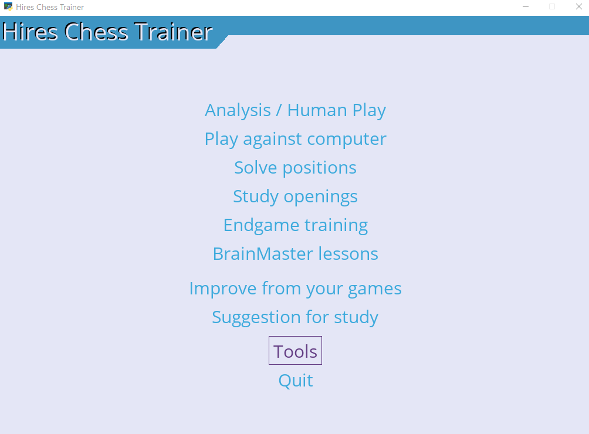</p>

Le voci sono raggruppate: prima le modalità di gioco/allenamento, poi gli
strumenti che analizzano le tue partite, infine le utility.

| Voce | Cosa fa |
|------|---------|
| **Analysis / Human Play** | Due giocatori umani sulla stessa scacchiera. È anche la **modalità di analisi** (varianti + annotazioni) ed è il *quartier generale* per posizione setup, salva-tattica, statistiche posizione vs DB di riferimento (vedi §3.3). |
| **Play against computer** | Gioca una partita contro il motore. |
| **Solve positions** | Ripassa le posizioni (errori) salvate in una *learning base*. |
| **Study openings** | Esercitati su partite "modello": devi trovare tu la mossa migliore. |
| **Endgame training** | Risolvi finali da un PGN di studi (cartella `endgames/`); giudice TB Syzygy (≤7 pezzi) con fallback Stockfish, errori loggati in una learning base dedicata (vedi §3.8). |
| **BrainMaster lessons** | Lezioni guidate dal servizio BrainMaster *(appare solo se hai configurato `base_url`)*. |
| **Improve from your games** | Wizard guidato: scarica le tue partite Chess.com → trova errori (tattica/aperture) → propone subito la pratica locale. La via più rapida per allenare i propri errori (vedi §3.1). |
| **Suggestion for study** | Analizza un tuo file PGN (download da Chess.com/lichess) e propone un ranking di "urgenza di studio" per codice ECO. Click su una riga → analisi mirata di quella sola apertura + pratica focused (vedi §3.7). |
| **Tools** | Creazione/aggiornamento di learning base, import PGN/Chess.com, Setup. |
| **Quit** | Esce dal programma (anche premendo **`Q`** o chiudendo la finestra). |

---

## 3. Le modalità

### 3.1 Migliora dalle tue partite (wizard)

<p align="center">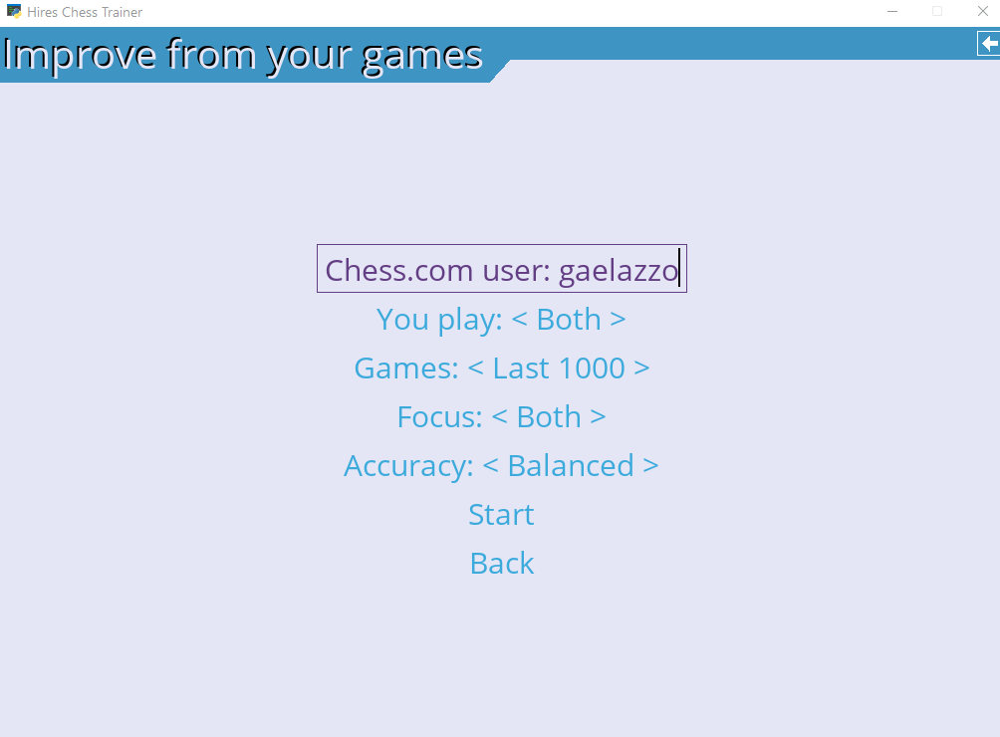</p>
> **Via guidata.** Da un input minimo (username Chess.com + 4 selettori) il wizard fa
> tutto: scarica le partite, crea/aggiorna le learning base, le analizza con preset
> scelti automaticamente, e ti porta direttamente nella pratica locale.

Parametri:
- **Utente Chess.com** — il tuo username.
- **Giochi** — *White* / *Black* / *Both* (filtra il download).
- **Partite** — *Ultime 500 / 1000 / 2000 / Tutte*. Scarica solo gli archivi mensili necessari,
  partendo dai più recenti; pensato per chi ha decine di migliaia di partite (es. bullet/lampo)
  e non vuole rivedere errori di anni fa.
- **Focus** — *Tattica*, *Aperture* o *Entrambi*. Tattica e aperture sono **due analisi
  distinte** con parametri diversi sotto il cofano: la tattica esamina tutta la partita con
  soglia alta (solo veri blunder); le aperture solo le prime mosse con `useBook=True`, così
  le mosse da libro non vengono segnalate e si trovano le deviazioni che peggiorano la
  valutazione. Selezionando *Entrambi* il motore gira **due volte** sulle stesse partite
  (una passata per focus).
- **Accuratezza** — *Quick / Balanced / Thorough*: preset di `ponderTime`, `blunderValue`,
  `movesToAnalyze` adatti a ciascun focus.

A fine analisi compaiono i pulsanti **Allena tattica / aperture** che entrano in
*Solve positions* sulla base `<utente>_tactics` o `<utente>_openings` (vedi §3.4). Le basi
restano persistenti in `data/`: nelle sessioni successive si entra direttamente da
*Solve positions* scegliendo la base.

### 3.2 Play against computer
Imposta i parametri e premi **Play**:
- **You play**: White / Black / Random (con chi giochi tu);
- **ELO**: forza del motore (1350–2850);
- **ELO MAX**: se attivo, il motore gioca alla massima forza ignorando l'ELO.

Muovi con il mouse; il computer risponde automaticamente.

### 3.3 Play between humans (analisi)
Due umani giocano a turno sulla stessa scacchiera. Poiché **non c'è un motore che
risponde**, questa è la modalità giusta per **analizzare** *e* per **costruire
manualmente posizioni** (vedi i due sub-mode più sotto): puoi tornare indietro,
provare mosse alternative (varianti), annotarle e commentarle (vedi §5 e §6).

#### Sub-mode: Setup posizione (tasto **U** o bottone ✏️ *Edit position*)

<p align="center">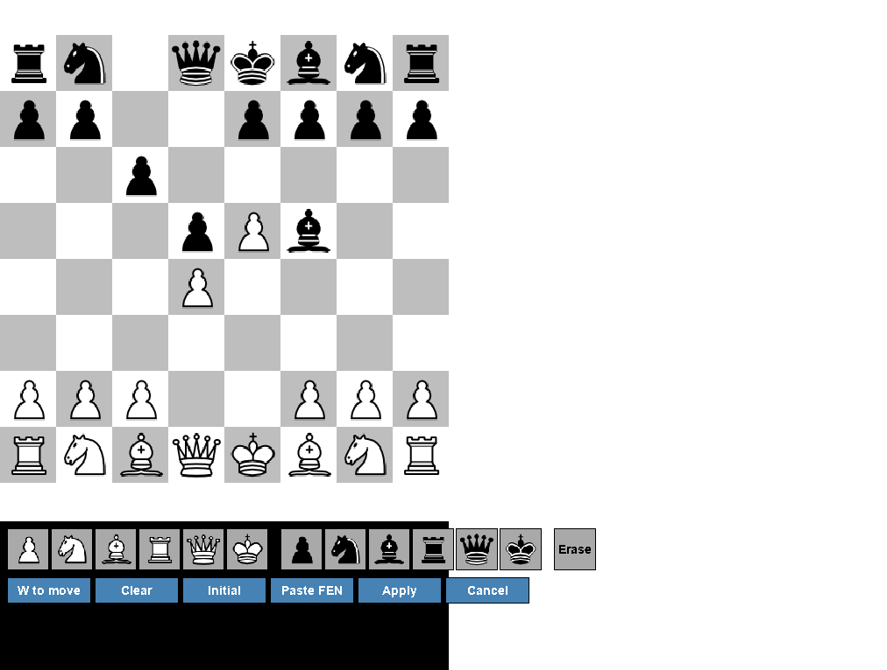</p>
> Editor visuale di posizione modale. Costruisci da zero, modifichi quella
> corrente, o incolli una FEN dalla clipboard. Utile per aggiungere studi di
> finale ai PGN di esercitazione, o per riprodurre una posizione vista in un
> libro / diagramma online.

- **Palette pezzi** sotto la scacchiera: 6 bianchi + 6 neri + *Erase*. Click su
  una cella la "arma" (evidenziata in giallo); click su una casa della
  scacchiera piazza il pezzo. **Click destro** su una casa = cancella.
- **Bottoni**: *STM* (toggle Bianco/Nero al tratto), *Clear* (board vuota),
  *Initial* (posizione iniziale standard), *Paste FEN* (legge la clipboard
  e applica), *Apply*, *Cancel*. **Enter** = Apply, **Esc** = Cancel.
- **Validazione su Apply**: esattamente 1 re per lato, niente pedoni su
  1ª/8ª riga, FEN parsabile, re avversario NON sotto scacco quando è il
  proprio tratto (posizione altrimenti illegale). Errori in rosso, resti
  nell'editor.
- **Castling rights**, **en passant** e **halfmove clock** vengono azzerati
  di default (le posizioni di studio partono "pulite"). Per modificarli a mano
  edita la FEN nel PGN salvato.
- Una volta applicato, la nuova posizione è la posizione iniziale di `gs`.
  Salva con il consueto **S** (Save) — vedi §7 per il dialogo e la cartella
  di destinazione.

#### Sub-mode: Salva tattica in learning base (tasto **K** o bottone 🧩 *Save as tactic*)
> Workflow per costruire manualmente posizioni di tattica con la mossa
> corretta da memorizzare. Tu sei il "judge": niente engine, niente Update
> learning base — adatto a quando hai un libro / diagramma in mano.

Flusso:
1. (Opzionale) usa **U** per costruire o incollare la posizione del problema.
2. **Gioca la mossa corretta** sulla scacchiera (un click di partenza + uno
   di arrivo, come una mossa qualsiasi).
3. Premi **K**: si apre un menu che mostra la FEN della posizione e la mossa
   corretta in SAN (es. *"Nxf3 (g1f3)"*).
4. Scegli la base di destinazione:
   - **Choose base file** → file selector con le `base_*.json` esistenti, o
   - **Oppure nuova base** → text input per crearla al volo (parametri default
     adatti a tattica: `movesToAnalyze=16`, `blunderValue=80`, `useBook=False`).
5. *Save* → posizione + mossa salvate come `LearnPosition` (zobrist, FEN,
   `ok` = la mossa giocata in UCI, `severity=100`). Subito drillabile in
   *Solve positions* scegliendo quella base.

Se premi **K** senza aver giocato una mossa, vedi *"Gioca prima la mossa
corretta"* e nulla viene salvato.

#### Sub-mode: Personal Stats — statistiche posizione vs il tuo DB di riferimento (tasto **Y** o bottone 📊 *Statistics*)

<p align="center"></p>
> **"Come ho giocato questa posizione le volte che l'ho avuta?"** — la feature
> più potente della modalità analisi. Conta in un PGN di riferimento (le tue
> partite di Chess.com/lichess, o un libro PGN qualsiasi) quante volte la
> posizione corrente si è verificata, con risultato finale e statistiche per
> ogni continuazione giocata.

Setup: **Tools → Setup → "Choose reference DB (le mie partite)"** apre un file
selector con cui scegli il PGN (può stare in `pgn/`, in `endgames/`, ovunque).
Il path completo è memorizzato in `config.reference_db`.

Attiva/disattiva il pannello **Personal Stats** con **Y** (o il bottone 📊 *Statistics*):
come i pannelli libro / engine / PGN resta acceso e si **aggiorna in tempo reale
sulla posizione corrente** mentre navighi. La scacchiera resta visibile. Il
pannello mostra, in colonne monospace allineate:
- **Trovata N volte** — quante volte la stessa posizione (zobrist hash)
  compare nel DB.
- **W X% D X% L X%** — dal POV del Bianco (convenzione DB scacchistici).
- una tabella **mossa / occorrenze / W-D-L** delle continuazioni giocate da qui,
  ordinata per frequenza decrescente.

Esempio reale su un DB di 12k partite: dalla posizione iniziale il programma
ti dice subito che in 9714 partite hai giocato 1.e4 e ne hai vinte 4365 contro
4970 perse — *informazione che cambia il modo di studiare le tue aperture*.
Funziona su qualsiasi posizione: di mid-game con un pezzo sviluppato in modo
inusuale, di finale dopo una specifica continuazione, ecc.

**Indicizzazione e cache disco.** Per query in tempo costante il programma
costruisce un indice `zobrist → [(result, next_uci)]` sulla mainline di ogni
partita del DB. L'indice viene serializzato su disco accanto al PGN come
`<pgn>.idx` (pickle binario, ~20 MB per 12k partite) e ricaricato automaticamente
all'avvio durante lo splash screen:
- **Primo avvio dopo aver scelto il DB**: build da PGN, ~10-15s per 40k
  partite. Salva il `.idx`. Lo splash mostra "Indicizzo N partite..." aggiornato
  ogni 50 game.
- **Avvii successivi**: load del `.idx` da disco, ~1-3s.
- **Il PGN cambia** (download incrementale, edit manuale): `mtime`/`size` non
  combaciano più → ricostruzione automatica al prossimo avvio.

I file `.idx` sono già nel `.gitignore` — restano locali, non finiscono nel repo.

### 3.4 Solve positions

<p align="center">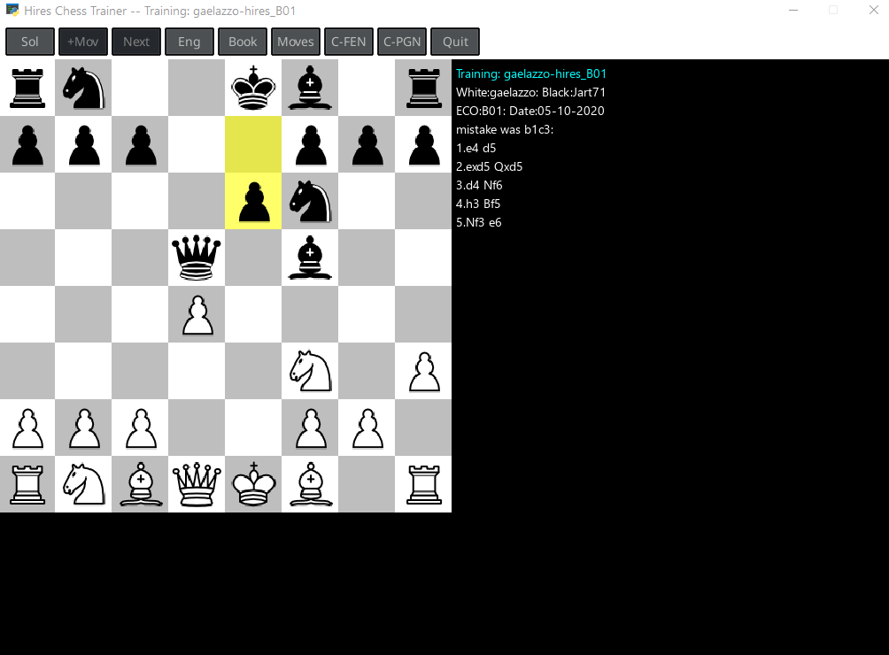</p>
> **Una posizione, una mossa.** Ti viene proposta una posizione e devi giocare la
> mossa giusta. Adatto a ripassare *qualsiasi cosa* (errori, tattica, finali…).

Ripassa le posizioni salvate in una *learning base* (tipicamente i tuoi errori).
Parametri:
- **ECO (optional)**: filtra per codice di apertura;
- **Choose base file**: scegli la learning base;
- **Lead-in moves**:
  - *Skip* (default) — salta la sequenza di mosse che precede la posizione-errore e ti
    mostra subito la posizione da risolvere;
  - *Replay* — il programma rigioca **tutta la sequenza di mosse della partita originale**
    fino alla posizione, così "entri nel contesto" prima di rispondere (utile soprattutto
    per le aperture).
- **Num Moves to Show**: numero di mosse di **continuazione** che il programma gioca *dopo*
  che hai risposto correttamente, per farti vedere come dovrebbe proseguire la partita col
  gioco giusto. `0` = nessuna continuazione.
- **Practice order**:
  - *Random* (default) — solo `random.shuffle`, le posizioni escono in ordine casuale.
    Default perché su basi reali (in particolare le aperture) la priorità tende a saturare
    la sessione su poche posizioni a `wrong` molto alto (es. le prime mosse di un'apertura
    ripetute decine di volte nelle tue partite).
  - *Priority* — ordina per priorità `(quante volte hai sbagliato la posizione, gravità)`:
    le più ricorrenti e più gravi prima. Modalità "drill" — utile quando vuoi forzare la
    chiusura delle posizioni più sbagliate, accettando che la sessione si concentri su quelle.

Ti viene mostrata una posizione: **gioca la mossa che ritieni corretta**. Il programma
ti dice se è giusta; con **H** puoi vedere la soluzione.

> **Sessione di ripasso.** *Solve positions* mantiene una sessione "viva" con al più
> `maxErrorsToConsider` posizioni attive (default 10, configurabile in **Setup**). Una posizione
> entra quando viene proposta; esce **subito** se la risolvi al primo tentativo, oppure dopo
> `correctsToSolve` corrette consecutive (default 3, configurabile in Setup) se la sbagli almeno
> una volta. Le posizioni totalmente apprese (`serie ≥ correctsToLearn` sull'intera storia, non
> solo nella sessione; default 5, configurabile in Setup) vengono **ritirate dalla base** e non
> più proposte — finché non ne sbagli una di nuovo (es. rigiocandola in *Study openings*), il
> che la **riattiva** per il ripasso locale. Le due soglie sono **distinte e indipendenti**:
> `correctsToSolve` regola solo la sessione corrente, `correctsToLearn` regola il ritiro dalla base.
>
> **Quando finisce la sessione?** Immaginala come un lotto a scorrimento: a ogni round il
> programma o **pesca** una posizione nuova dalla base, o ti **ripropone** uno dei tuoi errori
> ancora aperti, con il mix regolato da `maxErrorsToConsider`. La base viene consumata posizione
> per posizione, e quelle che continui a sbagliare restano nel lotto finché non le chiudi. La
> sessione **finisce da sola** quando **tutte** le posizioni (non escluse, filtrate per ECO)
> della base sono state proposte **e** ogni errore è stato chiuso — oppure appena premi **Q**.
> Quindi, a differenza di *Study openings* (che gira all'infinito su una scelta casuale), *Solve
> positions* ha una **fine definita**: completarla significa aver ripassato tutta la base.

### 3.5 BrainMaster lessons
Come sopra, ma le posizioni e l'ordine di ripasso sono suggeriti dal servizio
**BrainMaster** (ripetizione spaziata). Scegli il **corso** e premi **Exercise**.
*(Visibile solo se hai configurato `base_url` in Setup.)*

### 3.6 Study openings

<p align="center">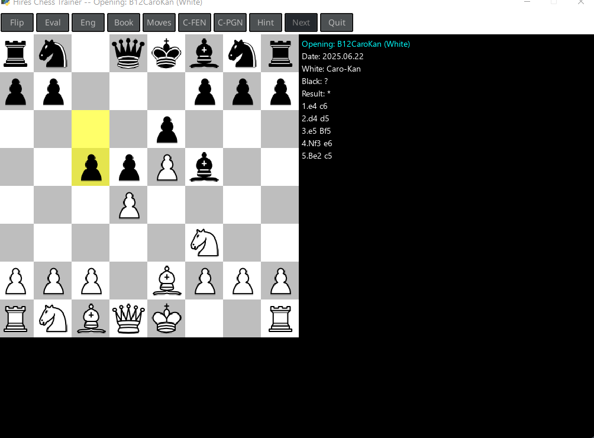</p>
> **Una linea intera.** Giochi tu l'intera sequenza dalla tua parte (le tue mosse
> sono fisse), mentre il computer può rispondere con **varianti diverse** tra quelle
> memorizzate. Tipico per **ripetere le aperture** / un repertorio.

Carichi un file PGN di linee "modello". Il computer gioca una delle linee
memorizzate e **tu devi trovare la mossa migliore** a ogni turno.
- **Choose PGN file**: il file con le partite modello;
- (Il colore che giochi viene **rilevato automaticamente dal contenuto del PGN**:
  conta tutte le varianti del file e prende la **maggioranza** — varianti `(N... ...)` =
  alternative del Nero (giochi Bianco), varianti `(N. ...)` = alternative del Bianco
  (giochi Nero). Pareggio esatto o nessuna variante → default Bianco. Una variante
  isolata "anomala" non ribalta più la scelta come faceva il vecchio first-match.)
- **Lead-in moves** e **Num Moves to Show**: stessa semantica di *Solve positions*
  (§3.4) — *Skip* salta la sequenza di lead-in e parte dalla posizione, *Replay* la
  rigioca tutta; *Num Moves to Show* è il numero di mosse di continuazione mostrate
  dopo una risposta corretta.
- **Hint** (tasto **H** o bottone 💡 *Hint*): mostra in SAN la prossima mossa attesa
  dalla mainline (es. *"Hint: Nf3"*) per 2 secondi. Disponibile solo quando è il
  tuo turno.

> **Profondità di partenza uniforme** (in *Lead-in = Skip*): a ogni round il programma
> pre-scansiona la mainline contando i turni utente `N`, sceglie un indice `k` uniforme
> in `[1, N]` e ti pone alla `k`-esima mossa utente. Nel tempo eserciti tutte le mosse
> del repertorio in proporzioni uguali (prima invece con prob. 1/3 di break ad ogni
> turno la distribuzione era geometrica: ~33% sulla 1ª mossa, ~0.2% sull'ultima).

> **Selezione casuale, sessione infinita.** A ogni round la linea è scelta **a
> caso** (uniformemente) tra le partite del PGN, e la posizione di partenza è
> scelta a caso al suo interno (vedi sopra). La modalità **non tiene memoria** di
> ciò che già conosci: le posizioni che padroneggi possono ricapitare, e la
> sessione **non termina mai da sola** — premi **Q** (o il bottone 🏠 *Torna al menu*)
> quando hai finito. È voluto: è pratica libera, non un drill finito. (Se vuoi un
> drill finito guidato dagli errori, che *invece* traccia i progressi e si ferma,
> usa *Solve positions* sulla base `openings_<filename>` — vedi *Persistenza
> errori* sotto.)

**Persistenza errori.** Come per *Allena finali*, ogni errore commesso durante
una sessione di Study openings viene registrato in una learning base dedicata
`openings_<filename>` in `data/`. Drillabile da *Solve positions* (la base
appare nel dropdown). Mosse corrette su posizioni già tracciate aggiornano le
stat (per la spaced repetition: `correctsToSolve` corrette consecutive →
uscita dalla sessione di Solve; `serie ≥ correctsToLearn` → ritiro dalla base, riattivata se la risbagli). Esempio
pratico: alleni C42 Russian su `C42Russian.pgn`, sbagli su 7 posizioni →
la base `openings_C42Russian` te le ripropone in Solve positions finché non
le hai chiuse.

### 3.7 Cosa studio adesso? (Study advisor)

<p align="center"></p>
> **Quale apertura dovrei studiare prossimamente?** L'advisor analizza le sole
> intestazioni di un tuo PGN (download Chess.com/lichess) e propone un ranking
> di urgenza di studio per codice ECO. Nessun motore coinvolto — istantaneo
> anche su file da migliaia di partite.

Parametri:
- **Utente/i** — il tuo username (come compare in `[White]`/`[Black]` del PGN).
  Puoi inserire **più nick separati da `,` o `;`** (es. i tuoi handle lichess e
  Chess.com, con un unico PGN unito); le partite sotto uno qualsiasi vengono
  aggregate. Il match è **case-insensitive** — come gli username su quei siti.
- **Colore** — *Entrambi* / *Bianco* / *Nero*: filtra le partite per il colore che hai
  giocato.
- **Choose PGN file** — il file su cui ragionare (tipicamente il download Chess.com o
  lichess; può essere lo stesso file con partite di entrambe le fonti — vedi §8).
- **Analyze** → schermata tabellare con il ranking.

Per ogni ECO la tabella mostra `Partite | W | D | L | Win% | Deficit`, ordinati per
**Deficit** decrescente. Il *deficit* è
`max(0, 0.5×N − (W + 0.5×D))` = "punti persi sotto la pari del 50%". Aperture con
win-rate ≥ 50% hanno deficit zero (qualsiasi sia il volume): non sono problemi da
studiare, anche se le hai giocate migliaia di volte.

Codice colore delle righe:
- **Rosso/salmone** — win-rate < 45% (sotto-performi, da curare);
- **Verde** — win-rate > 55% (vai bene);
- **Bianco** — zona neutra (45–55%).

Una **barretta gialla** sulla riga #1 segnala l'apertura con priorità massima.

**Click su una riga** → l'advisor analizza con il motore le sole partite con quel
codice ECO, costruisce/aggiorna una base mirata `<utente>_<ECO>` (o
`<nick1-nick2>_<ECO>` per più nick; preset
openings/Balanced, `useBook=True`) e ti porta direttamente in *Solve positions* su
quella base. Le basi mirate restano persistenti: nelle sessioni successive ti alleni
direttamente da *Solve positions*.

### 3.8 Allena finali

<p align="center">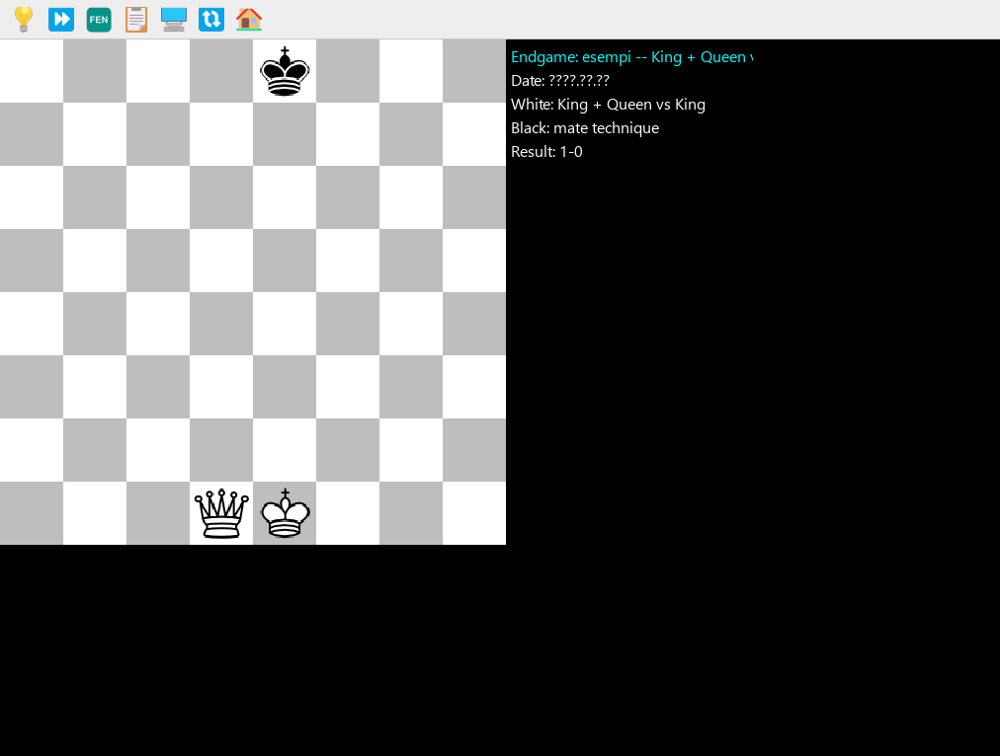</p>
> **Risolvi finali sotto il giudizio della tablebase.** Carichi un PGN di studi
> di finali (cartella `endgames/`); il programma pesca una partita random e usa
> la sua posizione iniziale come finale da risolvere. La mainline del PGN è
> ignorata: il giudice è la **TB Syzygy** (per posizioni ≤ 7 pezzi) o
> **Stockfish** in fallback.

**Setup TB.** Il path delle tablebase Syzygy va inserito una volta in
`config.json` come `engine_options.SyzygyPath` (stringa con i percorsi
separati da `;` su Windows, es. `"D:/.../345;D:/.../6"`). Verifica
l'integrità con `python verify_syzygy.py` e che Stockfish le veda davvero con
`python verify_stockfish_tb.py`.

Parametri:
- **Choose endgame PGN** — file `.pgn` dalla cartella `endgames/` (ogni partita
  con header `[FEN "..."]` è un finale separato).

Loop di gioco:
- Inizi al lato al tratto nella posizione di partenza. Pesca senza rimpiazzo
  entro la sessione: quando hai visto tutte le posizioni del file, ricomincia.
- **Giudizio strict** sulle tue mosse, in ordine:
  1. Stallo / materiale insufficiente forzato da te quando eri vincente → errore.
  2. Scacco matto da te dato → OK (massimo risultato).
  3. Caduta del clean WDL (sacrificio, sottopromozione errata, ecc.) → errore.
  4. **DTZ-optimality**: con `clean WDL = +2`, il DTZ post-mossa (dal nostro
     POV) deve essere uguale al **minimo raggiungibile** fra le mosse legali
     che preservano `WDL ≥ +2` — cioè devi giocare *una* delle ottime TB,
     non solo una "+2 che progredisce". Tollera correttamente i casi
     *near-zeroing* dove l'ottima ha `dtz_a == dtz_b` (es. KQ vs KP all'ultimo
     ply, mate forzato via promozione obbligata del pedone nero); messaggio
     d'errore: *"non ottima: DTZ X→Y (ottima raggiungibile = Z)"*.
  5. Fuori range TB: confronto eval Stockfish; drop > 100 cp → errore.
- **Errore** → la mossa NON viene applicata, lampeggia "Mossa errata: \<causa\>"
  per 2.5s, riprovi sulla stessa posizione.
- L'avversario gioca **TB-ottima** quando in range (massimizza DTZ se perde,
  minimizza se vince), altrimenti Stockfish.
- Tasto **H** (o bottone 💡 *Hint*) → mostra in SAN la mossa TB-ottima.

**Persistenza errori.** Ogni errore viene registrato in una learning base
dedicata `endgames_<filename>` in `data/`. Puoi ripassarla da *Solve positions*
(la base appare nel dropdown). Mosse corrette su posizioni già tracciate
aggiornano comunque le stat (per la spaced repetition).

---

## 4. Comandi durante una partita

Durante una partita (Play against computer / between humans) valgono questi comandi.
Premi **H** (o il bottone ❓ *Help*), oppure **tieni premuto il tasto destro del
mouse**, per vedere l'aiuto a schermo.

**Toolbar a icone.** Tutto quanto segue è anche a un clic. La **barra in alto** ha a
sinistra gli strumenti — apri/salva, copia FEN/PGN, i toggle di analisi e motore, i
pannelli laterali (libro, mosse PGN, Personal Stats), i lookup **piani** / **idee** /
**database** Lichess (in analisi), ribalta e aiuto — e a destra il
**gruppo di modifica posizione** (edit posizione, salva-come-tattica, taglia, elimina
variante) più 🏠 **Torna al menu**. La **barra in basso, sotto la scacchiera**, ha la
navigazione tra le mosse — **⏮ prima / ◀ precedente / ▶ successiva / ⏭ ultima** — il
🔀 bottone **Twins** (salta tra le trasposizioni) e le
azioni sulla mossa (annota / commenta / promuovi). I bottoni non applicabili al momento
sono sbiaditi; passa il mouse su un bottone per il tooltip con nome e scorciatoia. Ogni
bottone lancia semplicemente la sua scorciatoia da tastiera, quindi i tasti qui sotto
continuano a funzionare.

| Tasto | Azione |
|-------|--------|
| **clic mouse** | Seleziona la casella di partenza e quella di arrivo per muovere |
| **tasto destro** (tenuto) | Mostra il pannello di aiuto |
| **←** / **→** | Mossa precedente / successiva (se ci sono più varianti, le scegli da un menu) |
| **Home** / **End** | Prima / ultima mossa (l'ultima segue la linea principale) |
| **Shift+F** | Copia la posizione corrente (FEN) negli appunti |
| **Shift+P** | Copia l'intera partita (PGN, con varianti e annotazioni) negli appunti |
| **S** | Salva la partita |
| **L** | Lock side / orientamento scacchiera (blocca l'auto-ribaltamento sul lato al tratto) |
| **F** | Ruota la scacchiera |
| **R** | Reset (nuova partita) |
| **E** | Motore di analisi ON/OFF (mostra la valutazione) |
| **B** | Mostra/nascondi il libro di aperture |
| **M** | Mostra/nascondi il pannello **PGN moves** (il proseguio della linea corrente, in SAN) |
| **Q** | Torna al menu principale |

**Solo in "Play between humans" (analisi):**

| Tasto | Azione |
|-------|--------|
| **O** | Apri / carica una partita (parte dalla prima mossa, da scorrere con →) |
| **A** | Annota l'ultima mossa con un glifo (`!`, `?`, `!!`, `??`, `!?`, `?!`, `±`, …) |
| **T** | Aggiungi un commento testuale **multi-riga** all'ultima mossa (Invio = a capo, Ctrl+Invio = salva) |
| **V** | Apri il pannello **Notazione** (intera partita + varianti) |
| **P** | **Promuovi** la variante corrente a linea principale nel punto in cui si dirama. Se la diramazione è sulla linea principale, la variante diventa la linea principale; se sei dentro una sotto-variante viene promossa nell'ambito della linea che la contiene — premi **P** di nuovo per salire di un altro livello. Non distruttivo (riordina solo le varianti). |
| **U** | **Setup posizione**: editor visuale modale (vedi §3.3) |
| **K** | **Salva come tattica**: la posizione + l'ultima mossa giocata vanno in una learning base (vedi §3.3) |
| **Y** | Attiva/disattiva il pannello **Personal Stats**: W/D/L + continuazioni per la posizione corrente, dalle tue partite (vedi §3.3) |
| **G** | Analizza i **piani** tipici dal database *masters* di Lichess (in background; un popup elenca i piani numerati con lo score — premi **1–9** per disegnare le mosse di una variante come **frecce** sulla scacchiera, **0** per togliere) |
| **I** | Modifica il dossier **idee d'apertura** della struttura corrente (G lo precompila dal referto masters) |
| **D** | Statistiche dal **database Lichess** per la posizione corrente (tutti i giocatori, non masters — una query secca W/D/L) |
| **N** | Vai alla **trasposizione successiva** ("gemello") della posizione corrente; il bottone *Twins* si accende quando la posizione compare altrove nella partita |
| **J** / **Shift+J** | Vai all'occorrenza **originale** di una posizione trasposta / cerca una posizione per **FEN** (incollato dalla clipboard) |

> **Pannelli di analisi & layout.** In analisi attivi tre pannelli informativi
> in modo indipendente: **B** libro d'apertura, **M** *PGN moves* (il proseguio
> della linea corrente in SAN, sotto la lista mosse), **Y** *Personal Stats* (il
> tuo storico dal DB di riferimento per questa posizione). La lista mosse mostra
> **una mossa per riga** e scorre per tenere visibile l'ultima mossa giocata.

> **Pannelli laterali con navigazione tastiera.** Quando navighi tra le mosse
> di una partita caricata e ci sono varianti, o quando annoti una mossa con un
> glifo NAG, appare un **pannello laterale a destra della scacchiera** (non
> più menu full-screen che la copriva). Naviga con **↑/↓** (anche **Home/End**),
> conferma con **Enter** o **→** (è il tasto naturale di "vai avanti"),
> annulla con **Esc** (a un bivio di varianti annulla anche **←**, il tasto
> naturale di "torna indietro / non avanzare"). Click e hover col mouse continuano a funzionare in
> parallelo — l'hover prende il sopravvento sulla selezione tastiera solo se
> il mouse si muove davvero, così `↓↓↓ Enter` è sempre affidabile.

> Nelle modalità di studio (Solve positions / BrainMaster / Study openings /
> Allena finali) i comandi sono simili ma orientati alla soluzione: **Q** esci,
> **C/G** copia, **E/B/D** pannelli, **+** mostra qualche mossa in più (suggerimento),
> **H** mostra la soluzione / la mossa corretta (in Study openings = prossima mossa
> dalla mainline; in Allena finali = mossa TB-ottima).

> **Interrompere la lettura TTS dei commenti.** Quando il programma legge a voce
> un commento di una mossa, **qualsiasi tasto premuto o clic del mouse interrompe
> la lettura** e l'azione viene processata subito. Niente più "tempo morto"
> in attesa che il TTS finisca.

> **Fine partita.** A scacco matto / stallo il messaggio resta a schermo e la maschera **non
> si chiude automaticamente**: puoi ancora **salvare (S)**, **annullare l'ultima mossa (←)**,
> **resettare (R)**, o uscire (**Q**) quando vuoi.

> **Cosa sto allenando?** Durante una sessione di *Solve positions*, *Study openings* o
> *BrainMaster lessons* un'etichetta in **ciano** in cima al move log mostra il contesto
> corrente — `Allenando: <nome_base>`, `Apertura: <file> (Bianco/Nero)`, o
> `BrainMaster: <id_course>`. La stessa informazione appare anche nel **caption della
> finestra** (`Hires Chess Trainer -- Allenando: ...`).

---

## 5. Analizzare una partita

In **Play between humans** puoi costruire e annotare l'analisi di una partita.

**Inserire varianti.** Spostati su una posizione (con ←/→), poi **gioca col mouse una
mossa diversa** da quella già presente: viene aggiunta automaticamente come **variante**
a partire da quel punto. Le mosse già presenti si seguono con **→** (se ci sono più
continuazioni appare un menu di scelta).

**Annotare la qualità di una mossa (tasto `A`).** Apre un menu con i glifi standard;
quello scelto viene mostrato accanto alla mossa nella lista (es. `2. Nf3!`). Una mossa
ha **una sola** valutazione: sceglierne un'altra sostituisce la precedente; *(remove all)*
la rimuove. Glifi disponibili:

| Glifo | Significato | Glifo | Significato |
|-------|-------------|-------|-------------|
| `!` | buona mossa | `=` | posizione pari |
| `?` | errore | `∞` | poco chiara |
| `!!` | mossa eccellente | `⩲` / `⩱` | Bianco / Nero leggermente meglio |
| `??` | grave errore | `±` / `∓` | Bianco / Nero meglio |
| `!?` | interessante | `+−` / `−+` | Bianco / Nero vincente |
| `?!` | dubbia | `□` | mossa forzata |

**Commentare una mossa (tasto `T`).** Apre un editor **multi-riga**: scrivi il commento
(**Invio** = a capo), poi conferma con **Ctrl+Invio** (o il bottone **Save**), annulla con
**Esc**. Il commento appare nella lista mosse (in giallo) e nel pannello Notazione; gli a-capo
sono preservati nel PGN.

**Persistenza.** Glifi e commenti sono salvati nel PGN: con **S** (salva) o **Shift+P** (copia
PGN) restano nella partita e si ritrovano riaprendola, anche in altri programmi di scacchi.

**Piani d'apertura dai maestri (tasto `G`).** Da una posizione d'apertura, una query in
background al database *masters* di Lichess estrae i **piani tipici** per ciascun lato — gruppi
di mosse che ricorrono insieme — e li mostra in un popup: i piani numerati del lato al tratto con
uno score, e per ognuno la risposta tipica dell'avversario con il suo W/D/L. Premi **1–9** per
disegnare le mosse di un piano come **frecce** sulla scacchiera (bianche per il Bianco, nere per
il Nero), **0** per togliere. Il risultato è salvato anche nel dossier **idee** della struttura
(modificalo con **I**).

<p align="center">
  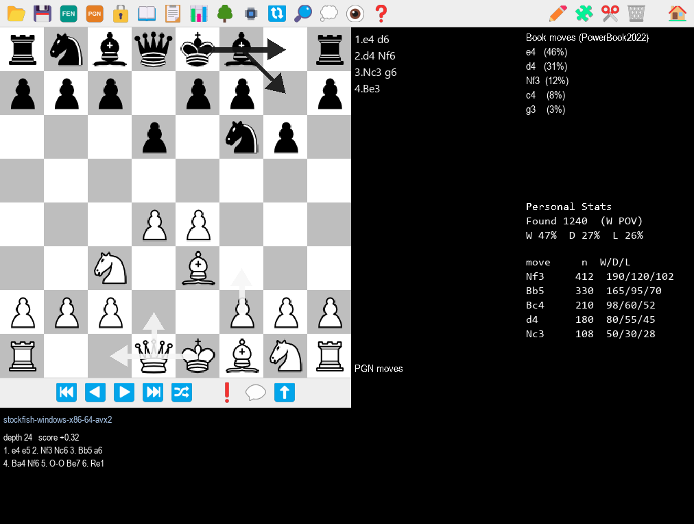<br>
  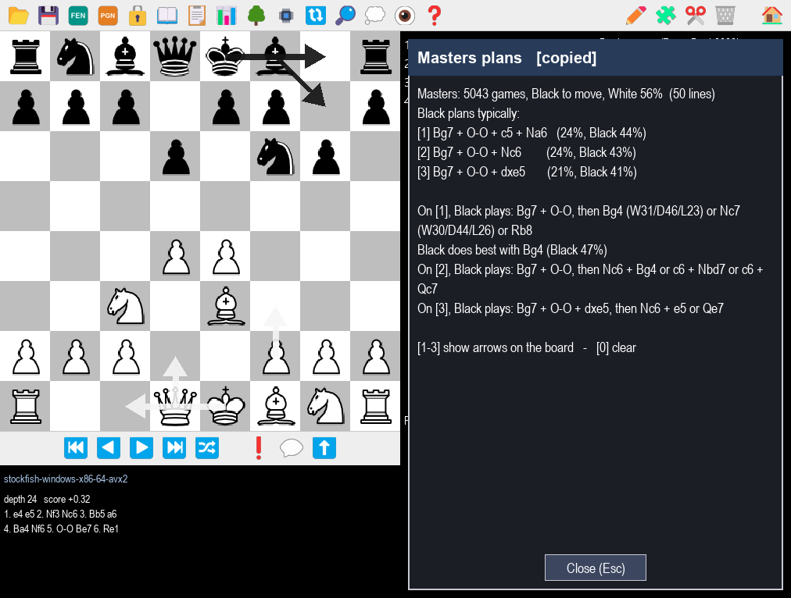
</p>

**Statistiche database Lichess (tasto `D`).** Una query secca — senza analisi dei piani — al
database completo di Lichess (tutti i giocatori): la distribuzione delle mosse per la posizione
corrente con W/D/L. Utile per vedere cosa affronti davvero al livello amatoriale (complementa il
motore e i tuoi libri).

<p align="center">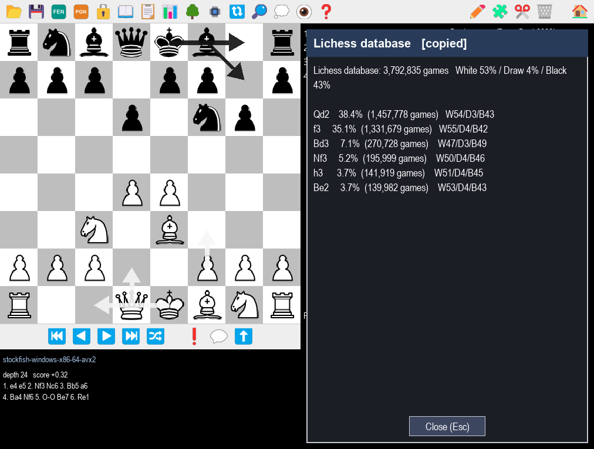</p>

**Trasposizioni.** Analizzando un'apertura con varianti, la stessa posizione si raggiunge spesso
per inversione di mosse. Il programma le rileva (posizione esatta):
- quando una mossa **traspone** in una posizione già presente, un banner avvisa e indica dove
  compare la prima volta;
- da una posizione **duplicata** la scacchiera non ti fa aggiungere nuove mosse (così l'analisi
  non si duplica) — premi **J** per andare all'originale e continuare lì;
- il bottone **Twins** (barra in basso) si accende quando la posizione compare altrove; cliccalo
  (o premi **N**) per ciclare tra i gemelli. **Shift+J** cerca una posizione da un FEN incollato.

---

## 6. Il pannello Notazione

<p align="center"></p>

Premi **`V`** (in Play between humans) per **affiancare** alla scacchiera un pannello con
**l'intera partita**: linea principale e **varianti indentate ad albero**, con glifi e
commenti. La scacchiera resta visibile a sinistra e **si aggiorna in tempo reale** seguendo
la mossa selezionata nel pannello (niente più mini-scacchiera d'angolo: la board vera fa
da anteprima).

| Comando | Azione |
|---------|--------|
| **←** / **→** | Mossa precedente / successiva |
| **↑** / **↓** | Riga precedente / successiva (passa tra linea principale e varianti) |
| **rotella**, **PgUp/PgDn**, **Home/End** | Scorri la vista |
| **clic su una mossa** | Vai a quella posizione (chiude il pannello) |
| **V** / **Esc** | Chiudi il pannello |

Alla chiusura la scacchiera principale resta sulla mossa selezionata. Mentre il pannello è
aperto la scacchiera non è cliccabile per muovere i pezzi: navighi dal pannello.

---

## 7. Salvare e caricare partite

- **Salva** (tasto **S**): apri il menu Save, scegli/crea il file PGN e i dati della
  partita (White, Black, Event, Site), poi **Save**.
  - **Result** è un selettore con le 4 sole opzioni PGN standard: `*` (in corso /
    sconosciuto), `1-0` (vince il Bianco), `0-1` (vince il Nero), `1/2-1/2`
    (patta). Niente più testo libero che confondeva i parser PGN downstream.
  - **Cartella di destinazione**: il selettore PGN parte da `pgn/`, ma se navighi
    in un'altra cartella (es. `endgames/` per salvare uno studio di finale
    appena costruito col setup posizione) e scegli un file lì, **il salvataggio
    rispetta la cartella scelta** invece di forzare sempre `pgn/`.
- **Apri / Carica** (tasto **O**, solo in Play between humans): scegli il file PGN e la partita
  dall'elenco. La partita viene caricata **dall'inizio**, così puoi scorrerla con **→**
  ed esplorarne le varianti.

---

## 8. Strumenti (Tools)

<p align="center">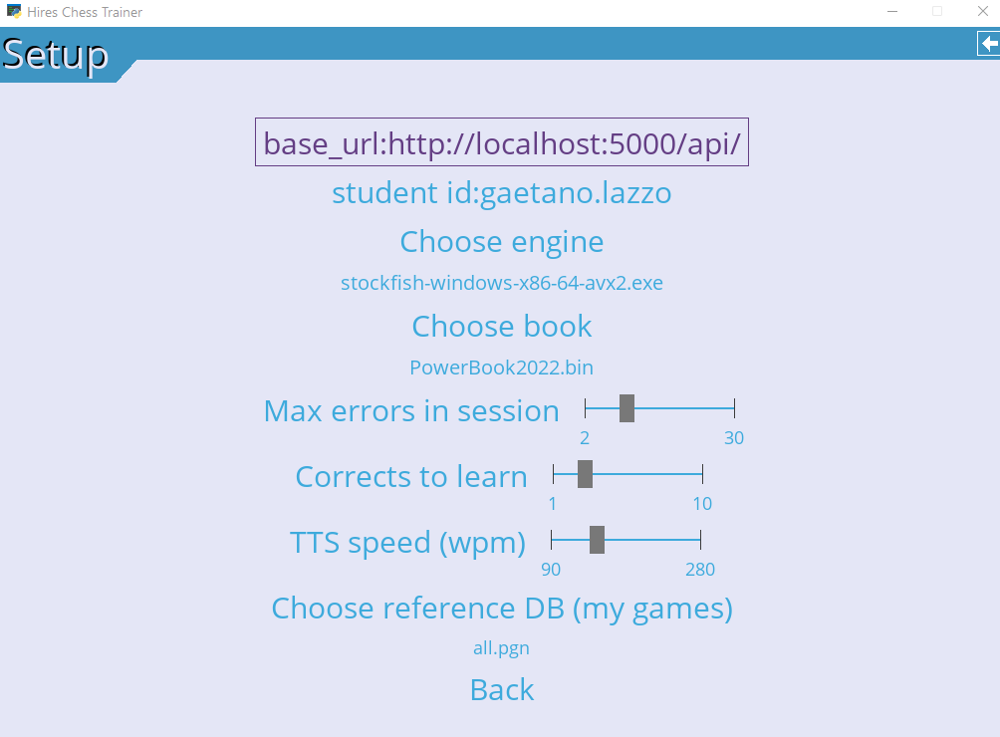</p>

| Strumento | A cosa serve |
|-----------|--------------|
| **Download Chess.com games** | Scarica le partite di un giocatore da Chess.com in un file PGN (indica file PGN, *player*, colore). **Incrementale**: se il file esiste, aggiunge solo le partite **nuove** (dedup per URL `[Link]` o composito di intestazioni); salta gli archivi mensili antecedenti l'ultima partita Chess.com già presente. Partite di altre fonti già nel file (es. lichess merged a mano) **restano intoccate**. |
| **Download lichess games** | Stessa logica per le partite lichess (API `/api/games/user/{user}`, parametro `since` per l'incrementale). Lo **stesso file PGN può contenere partite di entrambe le fonti** (Chess.com + lichess): dedup per signature URL, append-only. |
| **Create learning base** | Crea una nuova learning base vuota: `movesToAnalyze`, `blunderValue` (soglia errore in centipawn), `ponderTime`, `useBook`, `filename`. |
| **Update learning base** | Analizza le partite di un *player* in un PGN e **registra gli errori** nella base scelta (correzione errori). **Barra di avanzamento** N/M aggiornata ad ogni partita. |
| **Reset learned positions** | Riporta nel ripasso locale tutte le posizioni "imparate" della base scelta: azzera il flag `skip` e la `serie`, **mantenendo tutto lo storico dei tentativi**. Non distruttivo e solo locale (BrainMaster mantiene il suo scheduling). Riporta quante posizioni sono state riattivate. |
| **Unroll PGN file** | Trasforma un PGN in un insieme di **posizioni** dentro una learning base. |
| **Unroll PGN file as lesson** | Come sopra, ma come **lezione** (per il ripasso/BrainMaster). |
| **Create Course for BrainMaster** | Registra una learning base come **corso** BrainMaster *(se `base_url` configurato)*. |
| **Setup** | Configura (persistente in `config.json`): `base_url` e `id studente` (BrainMaster), **Choose engine** (motore UCI), **Choose book** (libro di aperture), **Choose reference DB (le mie partite)** (PGN per le statistiche di posizione, vedi §3.3), **Max errors in session** (capacità della sessione di *Solve positions*, default 10), **Corrects to solve (exit session)** (corrette consecutive per uscire dalla sessione dopo un errore, default 3), **Corrects to learn (retire)** (successi consecutivi che marcano una posizione come "imparata" e la ritirano dalla base — finché non la risbagli — default 5), **TTS speed (wpm)** (velocità della lettura vocale dei commenti, 90–280 wpm, default 170). |

**Configurazione TTS via `config.json` (avanzata)**: oltre allo slider in Setup,
puoi forzare manualmente la voce con `"tts_voice": "<sostringa>"` (es. `"zira"`,
`"david"`, `"english"` — match case-insensitive su `voice.name` o `voice.id` SAPI5).
Lasciandolo vuoto si fa auto-detect (cerca voci con `english` / `en-` / `zira` /
`david` / `mark` / `hazel` nel nome). All'avvio il programma stampa sulla console
l'elenco delle voci disponibili — utile per copiare la sostringa giusta.

> **Persistenza ultime selezioni nei menu.** Tutto quello che scegli nei menu
> (base in *Solve positions*, file PGN, *player*, *ELO*, *Lead-in*, *Practice order*,
> *Num Moves to Show*, ecc.) viene salvato in `config.user_prefs` e ricaricato al
> riavvio. Apri di nuovo *Solve positions* e trovi già l'ultima base che hai usato,
> non più "openings" hardcoded.

---

## 9. Concetti chiave

- **Learning base** — un archivio di posizioni da studiare con le statistiche dei tuoi
  tentativi. Vedi l'appendice tecnica per il formato. Tipicamente contiene i tuoi errori
  (creata con *Update learning base*) o posizioni estratte da partite (*Unroll PGN*).
- **BrainMaster** — servizio esterno (AI) che propone le posizioni da ripassare con
  ripetizione spaziata; richiede `base_url` e `id studente`.
- **ECO** — codice standard che identifica un'apertura (es. `C42`); usato per filtrare.
- **ELO** — misura della forza di gioco; per il computer si imposta in *Play against computer*.
- **FEN / PGN** — notazioni standard: FEN descrive una singola posizione, PGN un'intera
  partita (con varianti, glifi e commenti).
- **Glifi (NAG)** — i simboli di annotazione `! ? !? ± …` (vedi §5).

---

## 10. File e cartelle

| Cartella | Contenuto |
|----------|-----------|
| `data/` | Learning base (`base_<nome>.json` + `<nome>.csv`) |
| `pgn/` | Partite salvate e file PGN importati |
| `endgames/` | PGN di studi di finali per *Allena finali* (uno studio per partita, header `[FEN]`) |
| `engines/` | Motori UCI (es. Stockfish) |
| `books/` | Libri di aperture Polyglot (`.bin`) |

---

# Appendice tecnica: struttura della Learning Base

La *Learning Base* è la struttura dati che memorizza le posizioni da studiare/allenare
e tiene traccia dei progressi dell'utente su ciascuna di esse. È implementata in
[LearningBase.py](LearningBase.py).

### Organizzazione su disco

Ogni learning base è composta da **due file** salvati nella cartella `data/`:

| File | Contenuto |
|------|-----------|
| `base_<nome>.json` | Metadati/parametri della base (serializza `LearningBaseData`) |
| `<nome>.csv` | Elenco delle posizioni, una per riga (serializza i `LearnPosition`) |

All'avvio il modulo carica automaticamente tutte le basi presenti: cerca i file
`base_*.json` nella cartella `data/`, li carica e li espone nel dizionario
`learningBases`, indicizzato per nome (il prefisso `base_` viene rimosso da
`stripBaseName`). Se la cartella `data/` non esiste viene creata.

### `LearningBase` (la base)

Classe contenitore. Mantiene il dizionario delle posizioni e i parametri di analisi.

| Campo | Tipo | Descrizione |
|-------|------|-------------|
| `positions` | `Dict[int, LearnPosition]` | Posizioni, indicizzate per hash Zobrist |
| `movesToAnalyze` | `int` | Numero di mosse da analizzare |
| `blunderValue` | `int` | Soglia (in centipawn) per considerare una mossa un errore |
| `ponderTime` | `float` | Tempo di analisi/pondering del motore |
| `useBook` | `bool` | Se usare il libro di aperture |
| `filename` | `Optional[str]` | Nome base dei file su disco |

I metadati (`movesToAnalyze`, `blunderValue`, `ponderTime`, `useBook`, `filename`)
vengono incapsulati in `LearningBaseData` per il salvataggio nel file JSON, mentre le
posizioni vengono scritte separatamente nel file CSV.

Metodi principali:
- `load(filename)` / `save(filename)` — caricamento e salvataggio (JSON + CSV).
- `addPosition(game, board, goodMove)` — aggiunge una nuova posizione (se non già presente).
- `updatePosition(moveMade, goodMove, game, board)` — analizza la mossa giocata
  dall'utente e aggiorna le statistiche della posizione.
- `updatePositionStats(position, moveMade, date)` — logica di aggiornamento delle
  statistiche; restituisce `True` se la mossa giocata è quella corretta.

### `LearnPosition` (la singola posizione)

Dataclass che rappresenta una posizione di studio. Ogni riga del CSV corrisponde a un
`LearnPosition`.

| Campo | Tipo | Descrizione |
|-------|------|-------------|
| `zobrist` | `int` | Hash Zobrist della posizione (chiave univoca) |
| `fen` | `str` | Posizione in notazione FEN |
| `ok` | `str` | Mossa corretta (UCI) attesa in questa posizione |
| `move` | `str` | Mossa effettivamente giocata |
| `moves` | `str` | Sequenza di mosse UCI che portano alla posizione |
| `successful` | `int` | Numero di tentativi riusciti |
| `ntry` | `int` | Numero totale di tentativi |
| `white` | `str` | Giocatore con il Bianco (dalla partita di origine) |
| `black` | `str` | Giocatore con il Nero (dalla partita di origine) |
| `eco` | `Optional[str]` | Codice ECO dell'apertura |
| `gamedate` | `Optional[date]` | Data della partita di origine |
| `lastTry` | `Optional[date]` | Data dell'ultimo tentativo |
| `firstTry` | `Optional[date]` | Data del primo tentativo |
| `serie` | `int` | Contatore della serie corrente (positivo = successi consecutivi, negativo = errori) |
| `skip` | `bool` | Posizione "imparata", da saltare nel ripasso |
| `idquiz` | `Optional[int]` | Identificativo del quiz associato (opzionale) |
| `severity` | `int` | Peggior calo di valutazione (cp) osservato per questo errore — usato per la priorità in *Solve positions*. Popolato dall'analisi (`analyzeGame`) come `prevScore - evaluation`; sui campioni rivisti vince il massimo. Default `0` per le basi caricate da CSV senza la colonna (retro-compatibilità). |

`LearnPosition` offre anche metodi di conversione verso PGN (`to_Pgn`, `to_PgnString`)
e da dizionario (`from_dict`, usato per leggere le righe del CSV).

### Logica di apprendimento

Quando l'utente gioca una mossa, `updatePositionStats` aggiorna la posizione:
- incrementa `ntry` e aggiorna `firstTry`/`lastTry`;
- se la mossa coincide con `ok`, incrementa `successful` e la `serie` di successi;
  raggiunti `config.correctsToLearn` **successi consecutivi** (`serie >= correctsToLearn`,
  default 5, configurabile in Setup) la posizione viene marcata come imparata (`skip = True`)
  e ritirata dalla base (`getPositions` smette di proporla);
- se la mossa è errata, la `serie` diventa negativa (azzerando l'eventuale streak positivo);
  e se la posizione era già imparata (`skip = True`), viene **riattivata** (`skip = False`) e
  rientra nel ripasso locale. Siccome `serie` è ora negativa, dovrà guadagnarsi una nuova serie
  di `correctsToLearn` corrette prima di essere ritirata di nuovo. NB: una posizione imparata
  non viene mai mostrata in *Solve positions* (filtrata), quindi questo scatta solo quando la
  ri-incontri nei modi guidati dal PGN (*Study openings* / *Endgame training*) o quando viene
  ri-analizzata da *Update learning base*. Solo euristica locale — lo scheduling vero a lungo
  termine è di BrainMaster.

Distintamente, dentro una **sessione di *Solve positions*** vale anche un secondo countdown:
una posizione-errore esce **dalla sessione corrente** solo dopo `config.correctsToSolve`
risposte corrette consecutive (default 3, configurabile dal menu Setup). La sessione tiene
al più `config.maxErrorsToConsider` posizioni attive (default 10). Le due soglie sono
indipendenti: `correctsToSolve` regola l'uscita dalla **sessione**, `correctsToLearn`
(`serie >= correctsToLearn`) regola il ritiro dalla base (un errore riattiva la posizione —
vedi i punti su `updatePositionStats` sopra). (Nota legacy:
`correctsToLearn` un tempo indicava il conteggio di uscita dalla sessione; al primo avvio
viene migrato automaticamente in `correctsToSolve`, così le configurazioni esistenti non
cambiano comportamento — vedi `config.load_config`.)

### Priorità in *Solve positions*

`analyzer.getPositions(learningBase, filter, order)` restituisce le posizioni non ancora
imparate ordinandole secondo `order`:
- `"priority"` — `random.shuffle` (tiebreak) + `sort` stabile per
  `(ntry - successful, severity)`. La più alta finisce in fondo, e il consumatore in
  `solvePositionsFromBase` la serve per prima via `pop()`. La differenziazione effettiva
  richiede che `ntry`/`successful`/`severity` non siano uguali per tutte (vedi §3.4).
- `"random"` — solo `random.shuffle`, niente ordinamento.

La modalità si sceglie nel menu *Solve positions* (selettore *Practice order*).

---

## Architettura del codice (per sviluppatori)

Il codice è organizzato in moduli a responsabilità singola (refactoring di `chessMain.py`):

| Modulo | Ruolo |
|--------|------|
| `chessMain.py` | Orchestratore: costruisce il menu (`mainMenu`) e avvia il loop (`runMain`) |
| `app_context.py` | Stato dell'infrastruttura pygame (schermo, manager, font, clock…) come oggetto `app` |
| `state.py` | Stato di sessione condiviso (parametri, costanti) |
| `game_loop_common.py` | Helper condivisi dai loop di gioco (overlay aiuto, toggle pannelli, clipboard) |
| `menu_helpers.py` | Costruttori dei menu (selettori file, callback, ecc.) |
| `save_load.py` | Salvataggio/caricamento partite e relativi menu |
| `learningbase_admin.py` | Creazione/aggiornamento learning base, import PGN/Chess.com |
| `chess_com_download.py` | Download incrementale partite Chess.com (dedup per URL `[Link]`) |
| `lichess_download.py` | Download incrementale partite lichess (API `since`, dedup per URL `[Site]`) |
| `notation.py` | Pannello Notazione (vista albero affiancata alla scacchiera) |
| `move_speech.py` | Espande le mosse SAN nei commenti TTS (`Qe4` → "Queen to e4") |
| `toolbar.py` | `IconToolbar`: righe di bottoni a icone colorate disegnate a mano (hover/attivo/disabilitato + tooltip), condivisa da tutti i mode. Le icone in `images/icons/` sono generate dalle emoji da `tools/generate_icons.py` |
| `syzygy_helper.py` | Apre le TB Syzygy da `config.engine_options.SyzygyPath`, espone `probe_wdl/dtz/best_tb_move` |
| `verify_syzygy.py`, `verify_stockfish_tb.py` | Script diagnostici: integrità delle TB + verifica che Stockfish le veda davvero (`tbhits`) |
| `position_setup.py` | Editor visuale di posizione (palette pezzi + Paste FEN), sub-mode modale invocato da Analysis / Human Play (vedi §3.3) |
| `add_to_base.py` | Menu di scelta base + salvataggio "posizione corrente + ultima mossa giocata" come `LearnPosition` (workflow tattica manuale, vedi §3.3) |
| `position_stats.py` | Indicizzazione di un PGN di riferimento per query istantanee `zobrist → [(result, next_uci)]`; 3 livelli di cache (RAM/disco `<pgn>.idx`/rebuild); usato dal tasto Y in Analisi (vedi §3.3) |
| `modes/` | Le modalità di gioco: `play_game`, `brainmaster`, `replay`, `openings` (+ `common`), `endgames`, `improve` (wizard), `study_advisor`. Le modalità di gioco pilotano la scacchiera tramite il controller condiviso `BoardSession` |
| `modes/board_session.py` | **Controller headless** condiviso (`BoardSession` + una `ModePolicy` per-modalità): l'interazione sulla scacchiera di ogni modalità ci passa attraverso (`click` / `pick` / `do` / `next_move`) e si interroga via `view_model()`. Niente pygame — la logica di gioco si pilota e si verifica nei test senza display |
| `modes/commands.py`, `modes/pygame_input.py` | **Porta di input**: uno stream di `Command` consumato da `BoardSession.apply()`, alimentato da `ScriptedInput` (test) o `PygameInput` (mouse/tastiera) — stessa via per entrambi |
| `panels/` | **View layer** dei pannelli laterali (book / engine / pgn): ciascuno disegna da una slice di dati (lista di stringhe), disaccoppiato da `GameState` |
| `GameState.py` | Stato della partita, albero PGN, mosse, annotazioni. Contiene anche la classe `Voce` (TTS worker persistente, voce/rate SAPI5 settati direttamente sul COM object) |
| `BoardScreen.py` | Disegno della scacchiera e dei pannelli |
| `UCIEngines.py`, `book.py` | Motore UCI (single-thread polling: `start_analysis` + `poll()` per frame, niente worker dedicato per l'analisi) e libro di aperture |

I test sono in `tests/` (eseguire con `python -m pytest`).

---

## Autore

**Gaetano Lazzo** — AI Researcher e software developer presso
**Tempo S.r.l.** (Bari, Italia).

Da gennaio 2024 sta progettando un sistema di **reinforcement learning per
l'ottimizzazione dell'apprendimento umano**: rete globale + locale,
bootstrap e imitation learning, modello parametrico degli stadi della
memorizzazione affinato per singolo studente via discesa del gradiente.
Il progetto Hires Chess Trainer è un terreno di sperimentazione naturale
per quel filone — la ripetizione spaziata sulle posizioni-errore e la
classificazione delle aperture per deficit di performance qui sono
applicate in forma euristica; nella ricerca AI diventano apprese dal modello.

Esperienza pluriennale in progettazione e refactoring di software gestionali
e data-intensive, con focus su:

- **AI / ML**: reinforcement learning, bootstrap, imitation learning,
  modelli parametrici di memorizzazione, gradient descent.
- **Linguaggi**: Python, JavaScript / Node.js, C#, SQL.
- **Database**: Microsoft SQL Server, MySQL — interoperabilità,
  generazione di query, performance.
- **Aree software**: design pattern e architettura object-oriented,
  refactoring di codebase legacy, sicurezza e crittografia.

Progetti open-source pubblici tra cui
[`edge-sql`](https://github.com/gaelazzo/edge-sql),
[`jsDataSet`](https://github.com/gaelazzo/jsDataSet) e
[`jsDataAccess`](https://github.com/gaelazzo/jsDataAccess) (accesso DB
di alto livello da Node.js).

Note di approfondimento tecnico sul blog
[*Appunti di informatica*](https://advancedprogrammingnotes.blogspot.com/) —
refactoring, design patterns, crittografia, teoria dei numeri.

- GitHub: [@gaelazzo](https://github.com/gaelazzo)
- Email: ai@temposrl.com

---

