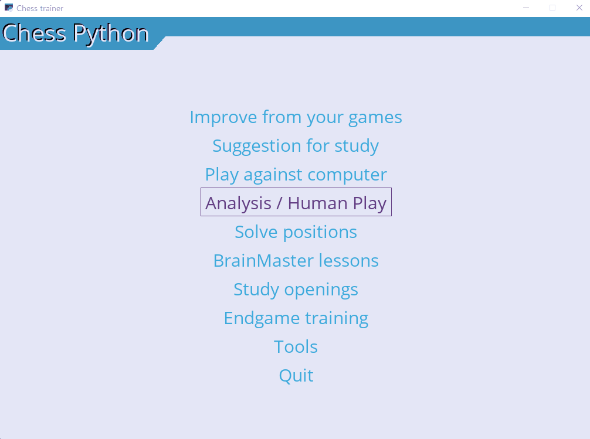
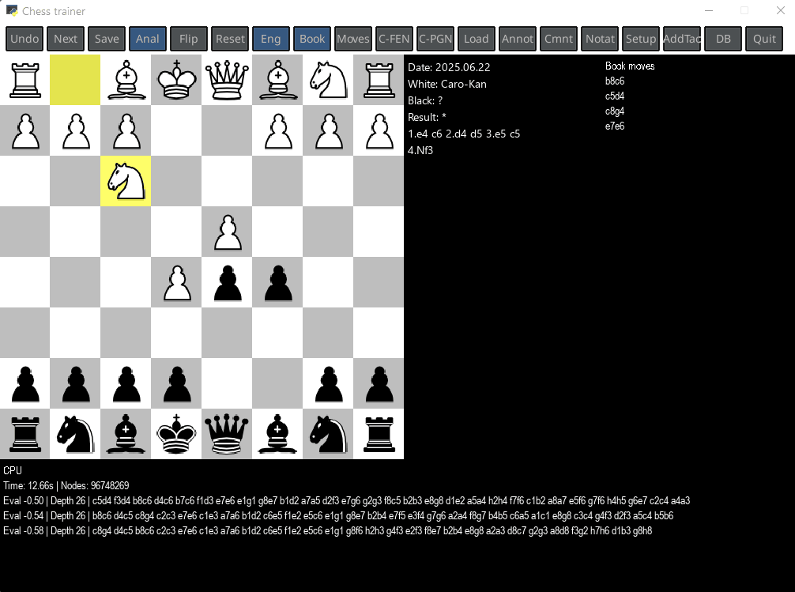
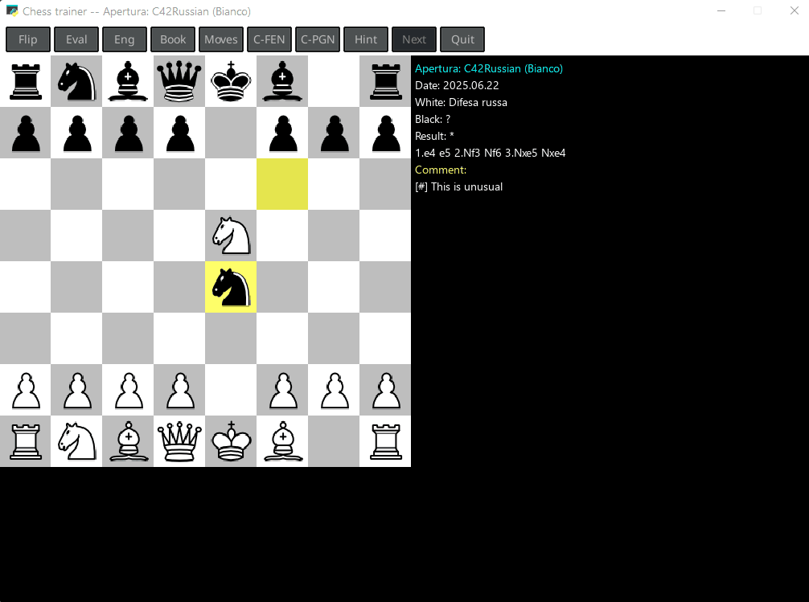
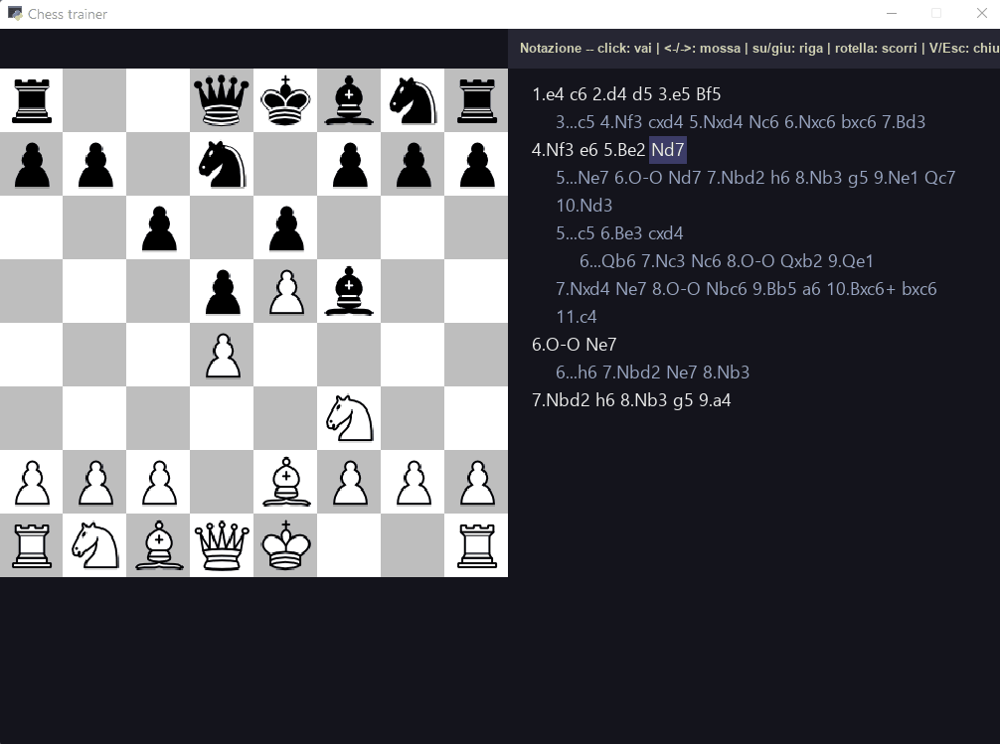

# Hires Chess Trainer

> **Train on YOUR real mistakes.** Import your games from Chess.com and
> lichess, find where you go wrong — tactics, openings, endgames — and fix
> those mistakes with **spaced repetition**, until they become automatic.

<p align="center">
  <!-- TODO: swap in docs/img/demo.gif (a short gameplay clip) once recorded; see docs/img/README.md -->
  
  <br><sub><em>Import your games → find your mistakes → focused spaced-repetition training.</em></sub>
</p>

📦 *Install:* [INSTALL.md](INSTALL.md) · 🔧 *Build the executable:* [BUILD.md](BUILD.md)

> Chess trainer in Python with Stockfish and Syzygy tablebases · learning bases
> with spaced repetition over tactics, opening repertoire and endgames ·
> auto-tracking of mistakes in every mode · position statistics against a
> reference PGN (your own games) · Chess.com and lichess game import ·
> testbed for **reinforcement-learning models of personalised learning** ·
> Windows-first.

🇮🇹 *Versione italiana:* [README.it.md](README.it.md)

**Hires Chess Trainer** is a desktop application for practising and improving at chess.
You can play against the computer or another human, **analyse** games with variations
and annotations, and **study** positions and mistakes through "learning bases" and
lessons (optionally assisted by the *BrainMaster* AI service).

## Screenshots

| Analysis — engine eval & opening book | Study openings | Notation panel |
|:---:|:---:|:---:|
| [](docs/img/screenshot-analysis.gif) | [](docs/img/screenshot-openings.gif) | [](docs/img/screenshot-notation.gif) |

---

## Contents
➡️ **New here?** Start with [Getting started: step-by-step recipes](#getting-started-step-by-step-recipes).

1. [Getting started](#1-getting-started)
2. [The main menu](#2-the-main-menu)
3. [The modes](#3-the-modes)
4. [In-game controls](#4-in-game-controls)
5. [Analysing a game: variations, annotations, comments](#5-analysing-a-game)
6. [The Notation panel](#6-the-notation-panel)
7. [Saving and loading games](#7-saving-and-loading-games)
8. [Tools](#8-tools)
9. [Key concepts](#9-key-concepts)
10. [Files and folders](#10-files-and-folders)
11. [Technical appendix](#technical-appendix-learning-base-format)

---

## 1. Getting started

Launch the program with:

```
python chessMain.py
```

Or from **VS Code**: open the folder and press **F5** (the "Run Chess" launch config is included in `.vscode/launch.json` with the correct cwd).

For full functionality you'll want (configurable via **Tools → Setup**, see §8):
- a **UCI engine** (e.g. Stockfish) in the `engines/` folder — used for analysis and for playing against the computer;
- (optional) a **Polyglot opening book** (`.bin`) in the `books/` folder;
- (optional) the **BrainMaster** service URL (`base_url`) and your `student id`, if you want to use the assisted lessons.

On startup the **main menu** appears; navigate with the **mouse** or the arrow keys and confirm with **Enter**.

> **Splash screen.** The first ~3-4 seconds of startup (TTS init, learning-base
> load, Polyglot book and Stockfish open) are covered by a window with
> `pic-chess.png` centred and *"Loading..."* at the bottom — no
> more silent console wait.

---

## Getting started: step-by-step recipes

*If this is your first time, start here: these are the most common tasks, step by step.*

### Recipe 0 — First-time setup (once)
1. **Tools → Setup → Choose engine**: select the UCI engine (e.g. `stockfish.exe`) from the
   `engines/` folder. Without an engine, analysis and playing against the computer won't work.
2. *(Optional)* **Choose book**: select a `.bin` opening book from `books/`.
3. *(Optional, for lessons)* fill in **base_url** and **student id** for the BrainMaster service.

### Main recipe — *Improve from your games* (wizard)
*The fastest way to train on your own mistakes from Chess.com games:
the wizard automates the steps that Recipes A/B do by hand.*
1. Main menu → **Improve from your games**.
2. Fill in:
   - **Chess.com user**: your username;
   - **Games**: *White*, *Black* or *Both* (filters the download by colour);
   - **Games (count)**: *Last 500 / 1000 / 2000 / All* (only the monthly archives needed are
     fetched, newest first — useful if you have thousands of games);
   - **Focus**: *Tactics*, *Openings* or *Both* (different parameter presets under the hood);
   - **Accuracy**: *Quick / Balanced / Thorough* (engine time vs depth).
3. **Start** — a progress screen shows `N/M` while the engine analyses. At the end you get
   **Train tactics / openings** buttons that jump straight into *Solve positions* on the
   newly-created base.
4. Later sessions resume from Main menu → **Solve positions** by picking the base
   `<user>_tactics` or `<user>_openings` (persisted in `data/`).

> The wizard is **idempotent**: re-running it after playing more games adds only the new
> mistakes (deduped by zobrist position).

### Recipe A — Correcting your own mistakes (manual flow, as White or Black)
*Goal: review the positions where you went wrong in your own games.*
1. **Download your games** — Tools → Download Chess.com games:
   - *PGN file to create*: a name, e.g. `my_white`;
   - *player*: your Chess.com username;
   - *Player color*: **White** for your White mistakes (use **Black** for Black ones);
   - **Download games**.
2. **Create an empty learning base** — Tools → Create learning base:
   - *filename*: e.g. `white_errors`;
   - *blunderValue*: mistake threshold in centipawns (e.g. `80` ≈ 0.8 pawns worse than the best move);
   - *movesToAnalyze*, *ponderTime*: how many moves to analyse and how much time to give the engine;
   - **Create learning base**.
3. **Fill the base with your mistakes** — Tools → Update learning base:
   - *player*: your username; *Choose PGN file*: `my_white`; *Choose base file*: `white_errors`;
   - **Update Learning Base** (the engine analyses your moves and records the wrong positions).
4. **Review** — Main menu → Solve positions → *Choose base file*: `white_errors` → **Play**.
   Those positions are served back to you: play the right move (**H** reveals the solution).
5. Repeat with **Player color = Black** for your Black mistakes (in a separate base, e.g. `black_errors`).

### Recipe B — Studying an opening / creating "models"
*Goal: train an opening repertoire.*
- **Get the opening PGN**, in two ways:
  - (a) copy an existing `.pgn` file (with the opening lines) into the `pgn/` folder; **or**
  - (b) **build it yourself**: *Play between humans*, play the opening moves, add **variations**
    (play alternative moves with the mouse), optionally annotate (**N**) and comment (**T**),
    then **Save (S)** to a PGN file.
- **Train on the repertoire** — Main menu → Study openings → *Choose PGN file* (your PGN)
  → **Play**: the computer plays the stored lines and you must find the right move.
  *(The colour you play is auto-detected from the PGN content — see §3.6.)*
- **(Alternatively) turn it into a study base** — Tools → Create learning base (e.g. `opening_x`)
  → Tools → **Unroll PGN file** (*Choose PGN* + *You play* your colour + *Choose base*) → then
  review it with **Solve positions**.

### Recipe C — Analysing a game with variations and annotations
1. Main menu → **Play between humans**.
2. Load a game (**L**) or play it; step through with **←/→**.
3. Try alternative moves **with the mouse** → they are added as variations.
4. Annotate the quality (**N**) and add comments (**T**).
5. See it all in the **Notation panel** (**V**); navigate with ←/→ and ↑/↓.
6. **Save (S)** or copy the PGN (**G**) to resume it later.

### Recipe D — Spaced-repetition lessons (BrainMaster)
*(Requires `base_url` configured in Setup.)*
1. Create a learning base (Recipe A or B).
2. Tools → **Create Course for BrainMaster** → *Choose base file* → **Create** (registers the
   base as a course). *(Alternatively: Tools → Unroll PGN file as lesson.)*
3. Main menu → **BrainMaster lessons** → choose the course → **Exercise**: the service decides
   which positions to serve you and when.

---

## 2. The main menu

| Item | What it does |
|------|--------------|
| **Improve from your games** | Guided wizard: download your Chess.com games → find mistakes (tactics/openings) → jump straight into local practice. The fastest way to train on your own mistakes (see §3.1). |
| **Suggestion for study** | Analyses one of your PGN files (Chess.com / lichess download) and proposes a "study urgency" ranking by ECO code. Click a row → focused engine analysis of that single opening + focused practice (see §3.7). |
| **Play against computer** | Play a game against the engine. |
| **Analisi / Human Play** | Two human players on the same board. Also the **analysis mode** (variations + annotations) and the *HQ* for position setup, save-as-tactic, and position statistics vs your reference DB (see §3.3). |
| **Solve positions** | Review the positions (mistakes) stored in a *learning base*. |
| **BrainMaster lessons** | Lessons driven by the BrainMaster service *(shown only if `base_url` is configured)*. |
| **Study openings** | Practise on "model" games: you must find the best move yourself. |
| **Endgame training** | Solve endgame studies from a PGN (folder `endgames/`); judged by Syzygy TB (≤7 pieces) with Stockfish fallback. Mistakes logged into a dedicated learning base (see §3.8). |
| **Tools** | Create/update learning bases, import PGN/Chess.com games, Setup. |
| **Quit** | Exit the program (also with **`Q`** or by closing the window). |

---

## 3. The modes

### 3.1 Improve from your games (wizard)
> **Guided path.** From minimal input (Chess.com username + 4 selectors) the wizard does
> everything: downloads games, creates/updates learning bases, analyses them with
> auto-chosen presets, and drops you straight into local practice.

Parameters:
- **Chess.com user** — your username.
- **Games** — *White* / *Black* / *Both* (filters the download).
- **Games (count)** — *Last 500 / 1000 / 2000 / All*. Only the monthly archives needed are
  fetched, newest first; designed for players with tens of thousands of games (e.g. bullet/blitz)
  who don't want to revisit ancient mistakes.
- **Focus** — *Tactics*, *Openings* or *Both*. These are **two distinct analyses** with
  different parameters under the hood: tactics scans the whole game with a high blunder
  threshold (only real blunders); openings looks at the first moves with `useBook=True`,
  so book moves are never flagged and you find the deviations that worsen the evaluation.
  Picking *Both* runs the engine **twice** over the same games (one pass per focus).
- **Accuracy** — *Quick / Balanced / Thorough*: presets for `ponderTime`, `blunderValue`,
  `movesToAnalyze`, tuned per focus.

When the analysis ends you get **Train tactics / openings** buttons that drop you into
*Solve positions* on the `<user>_tactics` or `<user>_openings` base (see §3.4). The bases
persist in `data/`; later sessions resume directly from *Solve positions* by picking the base.

### 3.2 Play against computer
Set the parameters and press **Play**:
- **You play**: White / Black / Random (which side you take);
- **ELO**: engine strength (1350–2850);
- **ELO MAX**: if on, the engine plays at full strength, ignoring the ELO setting.

Move with the mouse; the computer replies automatically.

### 3.3 Play between humans (analysis)
Two humans move in turn on the same board. Since **there is no engine replying**,
this is the right mode to **analyse** *and* to **manually build positions**
(see the two sub-modes below): you can take moves back, try alternative moves
(variations), annotate and comment them (see §5 and §6).

#### Sub-mode: Position setup (key **U** or *Setup* button)
> Modal visual position editor. Build from scratch, edit the current position,
> or paste a FEN from the clipboard. Handy for adding endgame studies to your
> practice PGNs, or reproducing a position seen in a book / online diagram.

- **Piece palette** under the board: 6 white + 6 black + *Erase*. Click a cell
  to "arm" it (highlighted in yellow); click a board square to place the piece.
  **Right click** on a board square = clear.
- **Buttons**: *STM* (toggle White/Black to move), *Clear* (empty board),
  *Initial* (standard starting position), *Paste FEN* (reads the clipboard and
  applies), *Apply*, *Cancel*. **Enter** = Apply, **Esc** = Cancel.
- **Validation on Apply**: exactly 1 king per side, no pawns on rank 1/8, FEN
  must parse, opponent's king NOT in check while it's your turn (otherwise
  illegal position). Errors shown in red, you stay in the editor.
- **Castling rights**, **en passant** and **halfmove clock** are reset by
  default (study positions usually start "clean"). For manual tuning, edit the
  FEN in the saved PGN.
- Once applied, the new position is the starting state of `gs`. Save with the
  usual **S** key — see §7 for the dialog and target folder.

#### Sub-mode: Save as tactic to learning base (key **K** or *AddTac* button)
> Workflow for manually building tactical problems with the correct move
> recorded. You are the "judge": no engine, no Update learning base — handy
> when you have a book / diagram in hand.

Flow:
1. (Optional) use **U** to build or paste the problem position.
2. **Play the correct move** on the board (source-square click + destination
   click, like any move).
3. Press **K**: a menu opens showing the FEN of the position and the correct
   move in SAN (e.g. *"Nxf3 (g1f3)"*).
4. Pick the target base:
   - **Choose base file** → file selector over the existing `base_*.json`, or
   - **Or new base** → text input to create one on the fly (defaults tuned
     for tactics: `movesToAnalyze=16`, `blunderValue=80`, `useBook=False`).
5. *Save* → position + move stored as a `LearnPosition` (zobrist, FEN, `ok` =
   the move you played in UCI, `severity=100`). Immediately drillable from
   *Solve positions* by picking that base.

If you press **K** without having played a move yet, you'll see *"Play the
correct move first"* and nothing is saved.

#### Sub-mode: Position statistics vs reference DB (key **Y** or *DB* button)
> **"How did I play this position the times I had it?"** — the most powerful
> feature of analysis mode. Counts how many times the current position
> occurs in a reference PGN (your Chess.com/lichess games, or any PGN book),
> with the final result and statistics for each continuation played.

Setup: **Tools → Setup → "Choose reference DB (my games)"** opens a file
selector for the PGN (can live in `pgn/`, `endgames/`, anywhere). The full
path is stored in `config.reference_db`.

Press **Y** on the current position → a side panel appears (to the right of
the board; the board stays visible) showing:
- **Found N times** — how many times the same position (zobrist hash) occurs
  in the DB.
- **W X (Y%) D X (Y%) L X (Y%)** — from White's POV (classic DB convention).
- **Continuations** — for each next move observed in the DB:
  `SAN  count  (W/D/L)`, sorted by descending frequency.

Real example on a 12k-game DB: from the starting position the program tells
you you've played 1.e4 in 9714 games and won 4365 vs lost 4970 —
*information that changes how you study your openings*. Works on any position:
a middlegame with an unusual piece placement, an endgame after a specific
continuation, etc.

**Indexing and disk cache.** For constant-time queries the program builds an
index `zobrist → [(result, next_uci)]` over the mainline of every game in
the DB. The index is serialised to disk next to the PGN as `<pgn>.idx`
(binary pickle, ~20 MB for 12k games) and automatically reloaded on startup
during the splash screen:
- **First start after picking the DB**: build from PGN, ~10-15s for 40k
  games. Writes the `.idx`. Splash shows "Indexing N games..." updated
  every 50 games.
- **Subsequent starts**: load the `.idx` from disk, ~1-3s.
- **PGN changes** (incremental download, manual edit): `mtime`/`size` no
  longer match → automatic rebuild on next start.

The `.idx` files are already in `.gitignore` — they stay local, never reach
the repo.

### 3.4 Solve positions
> **One position, one move.** You're given a position and must play the right move.
> Good for reviewing *anything* (mistakes, tactics, endgames…).

Review the positions stored in a *learning base* (typically your own mistakes).
Parameters:
- **ECO (optional)**: filter by opening code;
- **Choose base file**: pick the learning base;
- **Lead-in moves**:
  - *Skip* (default) — skips the lead-in move sequence and drops you straight onto the
    mistake-position to solve;
  - *Replay* — the program **replays the original game's move sequence** up to the
    position, so you "step into" the context before answering (especially useful for
    openings).
- **Num Moves to Show**: number of **continuation** moves the program plays *after* you
  answer correctly, to show how the game should proceed with correct play. `0` = no
  continuation.
- **Practice order**:
  - *Random* (default) — plain `random.shuffle`, positions come up in random order. Default
    because on real bases (especially openings) priority tends to saturate the session on a
    few positions with very high `wrong` (e.g. the first moves of an opening repeated dozens
    of times across your games).
  - *Priority* — sorts by priority `(times you got the position wrong, severity)`: the most
    recurring and most severe come first. "Drill" mode — useful when you want to force the
    closure of the worst positions, accepting that the session focuses on them.

A position is shown: **play the move you think is correct**. The program tells you
whether it's right; press **H** to reveal the solution.

> **Review session.** *Solve positions* keeps a "live" session with at most
> `maxErrorsToConsider` active positions (default 10, configurable in **Setup**). A position
> enters when proposed; it leaves **immediately** if you solve it on the first try, otherwise
> after `correctsToLearn` consecutive correct answers (default 3, configurable in Setup) once
> you've missed it. Fully learned positions (`serie ≥ 5` over the whole history, not just the
> current session) are **excluded from the base for life**.

### 3.5 BrainMaster lessons
Same idea, but the positions and review order are suggested by the **BrainMaster**
service (spaced repetition). Choose the **course** and press **Exercise**.
*(Visible only if `base_url` is configured in Setup.)*

### 3.6 Study openings
> **A whole line.** You play the entire sequence from your side (your moves are fixed),
> while the computer may reply with **different variations** among the stored ones.
> Typical for **drilling openings** / a repertoire.

You load a PGN file of "model" lines. The computer plays one of the stored lines and
**you must find the best move** at each turn.
- **Choose PGN file**: the file with the model lines;
- (The colour you play is **auto-detected from the PGN content**: the program
  counts ALL variations in the file and picks by **majority** — `(N... ...)`
  variations = Black alternatives (you play White), `(N. ...)` variations =
  White alternatives (you play Black). Exact tie or no variations → default
  White. A single anomalous variation no longer flips the verdict like the old
  first-match heuristic did.)
- **Lead-in moves** and **Num Moves to Show**: same semantics as *Solve positions*
  (§3.4) — *Skip* skips the lead-in and starts at the position, *Replay* replays it;
  *Num Moves to Show* is the number of continuation moves shown after a correct answer.
- **Hint** (key **H** or toolbar button): shows the next expected move from the
  mainline in SAN (e.g. *"Hint: Nf3"*) for 2 seconds. Available only on your turn.

> **Uniform depth-of-start** (with *Lead-in = Skip*): each round the program
> pre-scans the mainline counting the user's turns `N`, picks a uniform index
> `k` in `[1, N]`, and drops you at the `k`-th user move. Over time you drill
> every move of the repertoire in equal proportions (previously, with a 1/3
> break-probability per user turn, the distribution was geometric: ~33% on the
> 1st move, ~0.2% on the 16th).

**Mistake persistence.** Just like *Endgame training*, every mistake during a
Study openings session is logged into a dedicated learning base
`openings_<filename>` in `data/`. Drillable from *Solve positions* (the base
appears in the dropdown). Correct moves on already-tracked positions update
the stats (for spaced repetition: `correctsToLearn` consecutive corrects →
session exit; `serie ≥ 5` → permanently excluded from the base). Concrete
example: you drill C42 Russian on `C42Russian.pgn`, mess up on 7 positions →
the base `openings_C42Russian` keeps proposing them in Solve positions until
you've closed them all.

### 3.7 What should I study next? (Study advisor)
> **Which opening should I study next?** The advisor reads only the headers of
> one of your PGN files (Chess.com/lichess download) and produces an urgency
> ranking by ECO code. No engine involved — instant even on files with
> thousands of games.

Parameters:
- **User** — your username (as it appears in `[White]`/`[Black]` of the PGN).
- **Colour** — *Both* / *White* / *Black*: filter games by the colour you played.
- **Choose PGN file** — the file to reason on (typically the Chess.com or lichess
  download; the same file can hold games from both sources — see §8).
- **Analyze** → tabular ranking screen.

For each ECO the table shows `Games | W | D | L | Win% | Deficit`, sorted by
**Deficit** descending. The *deficit* is
`max(0, 0.5×N − (W + 0.5×D))` = "points lost below the 50% break-even". Openings
with win-rate ≥ 50% have zero deficit (whatever the volume): they are not
problems to study, even if you have played them thousands of times.

Row colour code:
- **Red/salmon** — win-rate < 45% (under-performing, needs attention);
- **Green** — win-rate > 55% (doing well);
- **White** — neutral zone (45–55%).

A **yellow bar** on row #1 marks the top-priority opening.

**Click a row** → the advisor runs the engine on the games with that ECO only,
builds/updates a focused base `<user>_<ECO>` (preset openings/Balanced,
`useBook=True`), and drops you straight into *Solve positions* on that base.
The focused bases persist, so later sessions resume directly from *Solve
positions*.

### 3.8 Endgame training
> **Solve endgames under tablebase judgment.** You load a PGN of endgame
> studies (folder `endgames/`); the program picks a random game from it and
> uses the game's starting position as the endgame to solve. The PGN's
> mainline is ignored: the judge is the **Syzygy TB** (for positions ≤7 pieces)
> with **Stockfish** as fallback.

**TB setup.** Set the Syzygy tablebase path once in `config.json` under
`engine_options.SyzygyPath` (semicolon-separated paths on Windows,
e.g. `"D:/.../345;D:/.../6"`). Verify integrity with `python verify_syzygy.py`
and that Stockfish actually sees the tables with
`python verify_stockfish_tb.py`.

Parameters:
- **Choose endgame PGN** — a `.pgn` file from the `endgames/` folder (each
  game with a `[FEN "..."]` header is one endgame study).

Gameplay loop:
- You start as the side to move at the starting position. Draw without
  replacement within the session; when you've seen all positions, the cycle
  restarts.
- **Strict judging** of your moves, in order:
  1. Stalemate / insufficient material forced by you while you were winning → mistake.
  2. Checkmate delivered by you → OK (best outcome).
  3. Clean WDL drop (sacrifice, wrong promotion, etc.) → mistake.
  4. **DTZ optimality**: with `clean WDL = +2`, the post-move DTZ (our POV)
     must equal the **minimum achievable** among legal moves preserving
     `WDL ≥ +2` — i.e. you must play *one of* the TB-optimal moves, not just
     any "+2-preserving move that progresses". Correctly tolerates *near-zeroing*
     cases where the optimal has `dtz_a == dtz_b` (e.g. KQ vs KP at the last
     ply, forced mate via the black pawn's compulsory promotion); error
     message: *"not optimal: DTZ X→Y (optimal reachable = Z)"*.
  5. Out of TB range: Stockfish eval comparison; drop > 100 cp → mistake.
- **Mistake** → the move is NOT applied, "Wrong move: \<reason\>" flashes for
  2.5s, you retry from the same position.
- The opponent plays **TB-optimal** when in range (maximizes DTZ when losing,
  minimizes when winning), otherwise Stockfish.
- Key **H** (or *Hint* button) → shows the TB-optimal move in SAN.

**Mistake persistence.** Every mistake is logged to a dedicated learning
base `endgames_<filename>` in `data/`. You can review it from *Solve positions*
(the base appears in the dropdown). Correct moves on already-tracked positions
still update stats (for spaced repetition).

---

## 4. In-game controls

During a game (Play against computer / between humans) the following controls apply.
**Hold the right mouse button** to see the on-screen help.

| Key | Action |
|-----|--------|
| **mouse click** | Click the source square then the destination square to move |
| **right mouse button** (held) | Show the help panel |
| **←** | Take back one move |
| **→** | Go to the next move (if several variations exist, pick from a menu) |
| **C** | Copy the current position (FEN) to the clipboard |
| **G** | Copy the whole game (PGN, with variations and annotations) to the clipboard |
| **S** | Save the game |
| **A** | Analysis mode (locks the board orientation) |
| **F** | Flip the board |
| **R** | Reset (new game) |
| **E** | Analysis engine ON/OFF (shows the evaluation) |
| **B** | Show/hide the opening book |
| **D** | Show/hide the move list |
| **Q** | Back to the main menu |

**Only in "Play between humans" (analysis):**

| Key | Action |
|-----|--------|
| **L** | Load a game (starts from the first move; step through with →) |
| **N** | Annotate the last move with a glyph (`!`, `?`, `!!`, `??`, `!?`, `?!`, `±`, …) |
| **T** | Add a text comment to the last move |
| **V** | Open the **Notation** panel (whole game + variations) |
| **U** | **Position setup**: modal visual editor (see §3.3) |
| **K** | **Save as tactic**: current position + last move played → learning base (see §3.3) |
| **Y** | **Position statistics vs reference DB**: side panel with W/D/L + continuations from your own history (see §3.3) |

> **Side panels with keyboard navigation.** When you navigate through the
> moves of a loaded game and there are variations, or when you annotate a
> move with a NAG glyph, a **side panel appears on the right of the board**
> (no more full-screen menu hiding it). Navigate with **↑/↓** (and
> **Home/End**), confirm with **Enter** or **→** (the natural "go forward"
> key), cancel with **Esc**. Mouse click and hover still work in parallel —
> hover overrides the keyboard selection only when the mouse actually moves,
> so `↓↓↓ Enter` is always reliable.

> In the study modes (Solve positions / BrainMaster / Study openings / Endgame
> training) the controls are similar but solution-oriented: **Q** quit, **C/G**
> copy, **E/B/D** panels, **+** show a few more moves (hint), **H** reveal the
> solution / the correct move (in Study openings = next move from the mainline;
> in Endgame training = TB-optimal move).

> **Interrupting the TTS comment read-aloud.** When the program is reading a
> move's comment aloud, **any key press or mouse click stops the speech** and
> the action is processed immediately. No more "dead time" waiting for the TTS
> to finish.

> **End of game.** On checkmate / stalemate the result message stays on screen and the
> view **does not auto-close**: you can still **save (S)**, **take back the last move (←)**,
> **reset (R)** or quit (**Q**) whenever you want.

> **What am I training?** During a *Solve positions*, *Study openings* or
> *BrainMaster lessons* session, a label in **cyan** at the top of the move log
> shows the current context — `Training: <base_name>`, `Opening: <file> (White/Black)`,
> or `BrainMaster: <id_course>`. The same information appears in the **window
> caption** (`Chess trainer — Training: ...`).

---

## 5. Analysing a game

In **Play between humans** you can build and annotate the analysis of a game.

**Adding variations.** Move to a position (with ←/→), then **play a different move with
the mouse** than the one already there: it is automatically added as a **variation** from
that point. Existing moves are followed with **→** (if there are several continuations a
selection menu appears).

**Annotating move quality (key `N`).** Opens a menu of standard glyphs; the chosen one is
shown next to the move in the list (e.g. `2. Nf3!`). A move has a **single** assessment:
choosing another one replaces the previous; *(remove all)* clears it. Available glyphs:

| Glyph | Meaning | Glyph | Meaning |
|-------|---------|-------|---------|
| `!` | good move | `=` | equal position |
| `?` | mistake | `∞` | unclear |
| `!!` | excellent move | `⩲` / `⩱` | White / Black slightly better |
| `??` | blunder | `±` / `∓` | White / Black better |
| `!?` | interesting | `+−` / `−+` | White / Black winning |
| `?!` | dubious | `□` | only move |

**Commenting a move (key `T`).** Opens a text field: type the comment and press **Save**.
The comment appears in the move list (in yellow) and in the Notation panel.

**Persistence.** Glyphs and comments are stored in the PGN: with **S** (save) or **G**
(copy PGN) they stay in the game and are restored when you reopen it, even in other chess
programs.

---

## 6. The Notation panel

Press **`V`** (in Play between humans) to open a panel **alongside the board** showing the
**whole game**: main line and **tree-indented variations**, with glyphs and comments. The
board stays visible on the left and **updates live** to follow the selected move in the
panel (no more corner mini-board — the real board acts as the preview).

| Control | Action |
|---------|--------|
| **←** / **→** | Previous / next move |
| **↑** / **↓** | Previous / next line (move between main line and variations) |
| **wheel**, **PgUp/PgDn**, **Home/End** | Scroll the view |
| **click on a move** | Jump to that position (closes the panel) |
| **V** / **Esc** | Close the panel |

On closing, the main board stays on the selected move. While the panel is open the board
is not clickable for piece moves: you navigate from the panel.

---

## 7. Saving and loading games

- **Save** (key **S**): open the Save menu, choose/create the PGN file and the game
  metadata (White, Black, Event, Site), then **Save**.
  - **Result** is now a selector with the 4 standard PGN values only: `*` (in
    progress / unknown), `1-0` (White wins), `0-1` (Black wins), `1/2-1/2`
    (draw). No more free text that confused downstream PGN parsers.
  - **Target folder**: the PGN selector opens in `pgn/`, but if you navigate to
    another folder (e.g. `endgames/` to save a study you just built via the
    position setup editor) and pick a file there, **the save respects the
    chosen folder** instead of always writing into `pgn/`.
- **Load** (key **L**, only in Play between humans): pick the PGN file and the game from
  the list. The game is loaded **from the start**, so you can step through it with **→**
  and explore its variations.

---

## 8. Tools

| Tool | Purpose |
|------|---------|
| **Download Chess.com games** | Download a player's games from Chess.com into a PGN file (give the PGN file, the *player*, the colour). **Incremental**: if the file already exists, only **new** games are appended (dedup by URL `[Link]` or a composite header signature); monthly archives older than the latest Chess.com game already in the file are skipped. Games from other sources already in the file (e.g. lichess merged by hand) **are left untouched**. |
| **Download lichess games** | Same logic for lichess games (API `/api/games/user/{user}`, `since` parameter for the incremental). The **same PGN file can hold games from both sources** (Chess.com + lichess): dedup by URL signature, append-only. |
| **Create learning base** | Create a new, empty learning base: `movesToAnalyze`, `blunderValue` (mistake threshold in centipawns), `ponderTime`, `useBook`, `filename`. |
| **Update learning base** | Analyse a *player*'s games in a PGN and **record the mistakes** into the chosen base (mistake correction). **Progress bar** N/M updated per game. |
| **Unroll PGN file** | Turn a PGN into a set of **positions** inside a learning base. |
| **Unroll PGN file as lesson** | Same, but as a **lesson** (for review / BrainMaster). |
| **Create Course for BrainMaster** | Register a learning base as a BrainMaster **course** *(if `base_url` is configured)*. |
| **Setup** | Configure (persisted in `config.json`): `base_url` and `student id` (BrainMaster), **Choose engine** (UCI engine), **Choose book** (opening book), **Choose reference DB (my games)** (PGN used for position statistics, see §3.3), **Max errors in session** (capacity of the *Solve positions* session, default 10), **Corrects to learn** (consecutive corrects needed to leave the session after a mistake, default 3), **TTS speed (wpm)** (read-aloud rate for move comments, 90–280 wpm, default 170). |

**TTS configuration via `config.json` (advanced)**: in addition to the slider in
Setup, you can force a specific voice with `"tts_voice": "<substring>"` (e.g.
`"zira"`, `"david"`, `"english"` — case-insensitive match against SAPI5
`voice.name` or `voice.id`). Leave empty for auto-detect (looks for `english` /
`en-` / `zira` / `david` / `mark` / `hazel` in the name). On startup the program
prints the available voices to the console — handy for copying the right
substring.

> **Last menu selections persist.** Everything you pick in the menus (the base
> in *Solve positions*, the PGN file, the *player*, *ELO*, *Lead-in*, *Practice
> order*, *Num Moves to Show*, etc.) is saved in `config.user_prefs` and
> reloaded on restart. Open *Solve positions* again and you'll find the last
> base you used, instead of the hardcoded "openings".

---

## 9. Key concepts

- **Learning base** — a store of positions to study, with the statistics of your attempts.
  See the technical appendix for the format. It typically holds your mistakes (created via
  *Update learning base*) or positions extracted from games (*Unroll PGN*).
- **BrainMaster** — an external (AI) service that proposes positions to review with spaced
  repetition; requires `base_url` and a `student id`.
- **ECO** — the standard code identifying an opening (e.g. `C42`); used for filtering.
- **ELO** — a measure of playing strength; for the computer it is set in *Play against computer*.
- **FEN / PGN** — standard notations: FEN describes a single position, PGN a whole game
  (with variations, glyphs and comments).
- **Glyphs (NAGs)** — the annotation symbols `! ? !? ± …` (see §5).

---

## 10. Files and folders

| Folder | Contents |
|--------|----------|
| `data/` | Learning bases (`base_<name>.json` + `<name>.csv`) |
| `pgn/` | Saved games and imported PGN files |
| `endgames/` | PGN endgame studies for *Endgame training* (one study per game, with `[FEN]` header) |
| `engines/` | UCI engines (e.g. Stockfish) |
| `books/` | Polyglot opening books (`.bin`) |

---

# Technical appendix: Learning Base format

The *Learning Base* is the data structure that stores the positions to study/train and
tracks the user's progress on each of them. It is implemented in
[LearningBase.py](LearningBase.py).

### On-disk layout

Each learning base consists of **two files** stored in the `data/` folder:

| File | Contents |
|------|----------|
| `base_<name>.json` | Base metadata/parameters (serialises `LearningBaseData`) |
| `<name>.csv` | List of positions, one per row (serialises the `LearnPosition`s) |

At startup the module automatically loads every base present: it looks for `base_*.json`
files in `data/`, loads them and exposes them in the `learningBases` dictionary, keyed by
name (the `base_` prefix is removed by `stripBaseName`). If `data/` does not exist it is
created.

### `LearningBase` (the base)

Container class. Holds the dictionary of positions and the analysis parameters.

| Field | Type | Description |
|-------|------|-------------|
| `positions` | `Dict[int, LearnPosition]` | Positions, keyed by Zobrist hash |
| `movesToAnalyze` | `int` | Number of moves to analyse |
| `blunderValue` | `int` | Threshold (centipawns) to consider a move a mistake |
| `ponderTime` | `float` | Engine analysis/ponder time |
| `useBook` | `bool` | Whether to use the opening book |
| `filename` | `Optional[str]` | Base name of the on-disk files |

The metadata (`movesToAnalyze`, `blunderValue`, `ponderTime`, `useBook`, `filename`) is
wrapped in `LearningBaseData` for the JSON file, while the positions are written separately
to the CSV file.

Main methods:
- `load(filename)` / `save(filename)` — load and save (JSON + CSV).
- `addPosition(game, board, goodMove)` — add a new position (if not already present).
- `updatePosition(moveMade, goodMove, game, board)` — analyse the move played by the user
  and update the position's statistics.
- `updatePositionStats(position, moveMade, date)` — statistics update logic; returns `True`
  if the played move is the correct one.

### `LearnPosition` (a single position)

A dataclass representing a study position. Each CSV row corresponds to one `LearnPosition`.

| Field | Type | Description |
|-------|------|-------------|
| `zobrist` | `int` | Zobrist hash of the position (unique key) |
| `fen` | `str` | Position in FEN notation |
| `ok` | `str` | Correct move (UCI) expected in this position |
| `move` | `str` | Move actually played |
| `moves` | `str` | Sequence of UCI moves leading to the position |
| `successful` | `int` | Number of successful attempts |
| `ntry` | `int` | Total number of attempts |
| `white` | `str` | White player (from the source game) |
| `black` | `str` | Black player (from the source game) |
| `eco` | `Optional[str]` | ECO code of the opening |
| `gamedate` | `Optional[date]` | Date of the source game |
| `lastTry` | `Optional[date]` | Date of the last attempt |
| `firstTry` | `Optional[date]` | Date of the first attempt |
| `serie` | `int` | Current streak counter (positive = consecutive successes, negative = mistakes) |
| `skip` | `bool` | Position "learned", to be skipped during review |
| `idquiz` | `Optional[int]` | Associated quiz id (optional) |
| `severity` | `int` | Worst eval drop (cp) observed for this mistake — used to prioritise in *Solve positions*. Populated by analysis (`analyzeGame`) as `prevScore - evaluation`; on repeated encounters the max wins. Defaults to `0` for bases loaded from a CSV without the column (backward-compatible). |

`LearnPosition` also offers PGN conversion methods (`to_Pgn`, `to_PgnString`) and a
`from_dict` constructor (used to read CSV rows).

### Learning logic

When the user plays a move, `updatePositionStats` updates the position:
- increments `ntry` and updates `firstTry`/`lastTry`;
- if the move matches `ok`, increments `successful` and the success `serie`; after
  **5 consecutive successes** (`serie >= 5`) the position is marked as learned (`skip = True`)
  and excluded **for life** from the base;
- if the move is wrong, `serie` becomes negative (resetting any positive streak).

Separately, within a **session of *Solve positions*** there is a second countdown: a
mistake-position leaves **the current session** only after `config.correctsToLearn`
consecutive correct answers (default 3, configurable in Setup). The session holds at most
`config.maxErrorsToConsider` active positions (default 10). The two thresholds are
independent: `correctsToLearn` rules leaving the **session**, `serie >= 5` rules permanent
exclusion from the base.

### Priority in *Solve positions*

`analyzer.getPositions(learningBase, filter, order)` returns the not-yet-learned positions
ordered by `order`:
- `"priority"` — `random.shuffle` (tiebreak) + stable `sort` by
  `(ntry - successful, severity)`. The highest priority ends up at the tail of the list and
  the consumer in `solvePositionsFromBase` serves it first via `pop()`. Effective only if
  `ntry` / `successful` / `severity` differ across positions (see §3.4).
- `"random"` — plain `random.shuffle`, no sorting.

The mode is picked in the *Solve positions* menu (*Practice order* selector).

---

## Code architecture (for developers)

The code is organised into single-responsibility modules (a refactoring of `chessMain.py`):

| Module | Role |
|--------|------|
| `chessMain.py` | Orchestrator: builds the menu (`mainMenu`) and runs the loop (`runMain`) |
| `app_context.py` | pygame infrastructure state (screen, manager, fonts, clock…) as the `app` object |
| `state.py` | Shared session state (parameters, constants) |
| `game_loop_common.py` | Helpers shared by the game loops (help overlay, panel toggles, clipboard) |
| `menu_helpers.py` | Menu builders (file selectors, callbacks, etc.) |
| `save_load.py` | Game saving/loading and related menus |
| `learningbase_admin.py` | Learning-base creation/update, PGN/Chess.com import |
| `chess_com_download.py` | Incremental Chess.com game download (dedup by URL `[Link]`) |
| `lichess_download.py` | Incremental lichess game download (API `since`, dedup by URL `[Site]`) |
| `notation.py` | Notation panel (tree view next to the board) |
| `move_speech.py` | Expands SAN moves in TTS-read comments (`Qe4` → "Queen to e4") |
| `toolbar.py` | Top toolbar with `UIButton`s + tooltips; shared by all modes |
| `syzygy_helper.py` | Opens the Syzygy TB from `config.engine_options.SyzygyPath`; exposes `probe_wdl/dtz/best_tb_move` |
| `verify_syzygy.py`, `verify_stockfish_tb.py` | Diagnostic scripts: TB file integrity + check that Stockfish actually sees them (`tbhits`) |
| `position_setup.py` | Visual position editor (piece palette + Paste FEN), modal sub-mode invoked from Analisi / Human Play (see §3.3) |
| `add_to_base.py` | Base-picker menu + saves "current position + last move played" as a `LearnPosition` (manual tactic workflow, see §3.3) |
| `position_stats.py` | Indexes a reference PGN for constant-time queries `zobrist → [(result, next_uci)]`; 3-level cache (RAM / disk `<pgn>.idx` / rebuild); used by key Y in Analisi (see §3.3) |
| `modes/` | The game modes: `play_game`, `brainmaster`, `replay`, `openings` (+ `common`), `endgames`, `improve` (wizard), `study_advisor` |
| `GameState.py` | Game state, PGN tree, moves, annotations. Also hosts the `Voce` class (persistent TTS worker thread; voice/rate set directly on the SAPI5 COM object) |
| `BoardScreen.py` | Board and panel rendering |
| `UCIEngines.py`, `book.py` | UCI engine (single-thread polling: `start_analysis` + `poll()` per frame, no dedicated analysis worker) and opening book |

Tests are in `tests/` (run with `python -m pytest`).

---

## Author

**Gaetano Lazzo** — AI Researcher and software developer at
**Tempo S.r.l.** (Bari, Italy).

Since January 2024 he has been designing a **reinforcement-learning system
for the optimisation of human learning**: global + local networks, bootstrap
and imitation learning, a parametric model of memorisation stages
tuned per student via gradient descent. The Hires Chess Trainer project
is a natural testbed for that line of research — spaced repetition on
mistake-positions and opening classification by performance deficit are
applied here as heuristics; in the AI research they become learned by the model.

Many years of experience in design and refactoring of management and
data-intensive software, with focus on:

- **AI / ML**: reinforcement learning, bootstrap, imitation learning,
  parametric models of memorisation, gradient descent.
- **Languages**: Python, JavaScript / Node.js, C#, SQL.
- **Databases**: Microsoft SQL Server, MySQL — interoperability, query
  generation, performance.
- **Software areas**: design patterns and object-oriented architecture,
  refactoring of legacy codebases, security and cryptography.

Public open-source projects include
[`edge-sql`](https://github.com/gaelazzo/edge-sql),
[`jsDataSet`](https://github.com/gaelazzo/jsDataSet) and
[`jsDataAccess`](https://github.com/gaelazzo/jsDataAccess) (high-level DB
access from Node.js).

Technical deep-dives on the blog
[*Appunti di informatica*](https://advancedprogrammingnotes.blogspot.com/) —
refactoring, design patterns, cryptography, number theory.

- GitHub: [@gaelazzo](https://github.com/gaelazzo)
- Email: ai@temposrl.com

---

